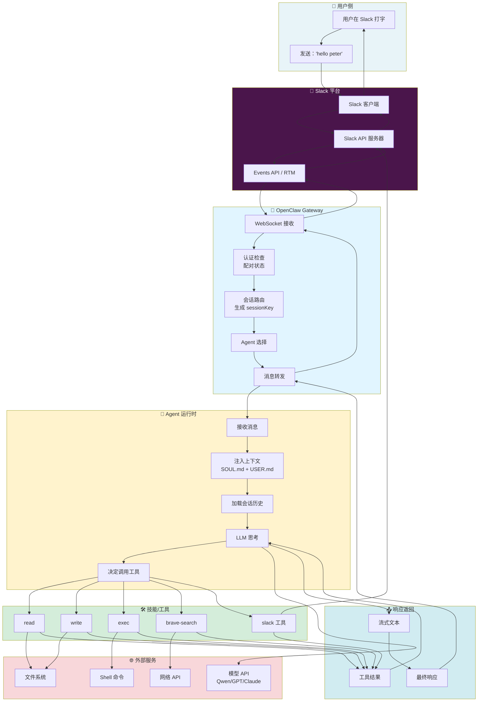
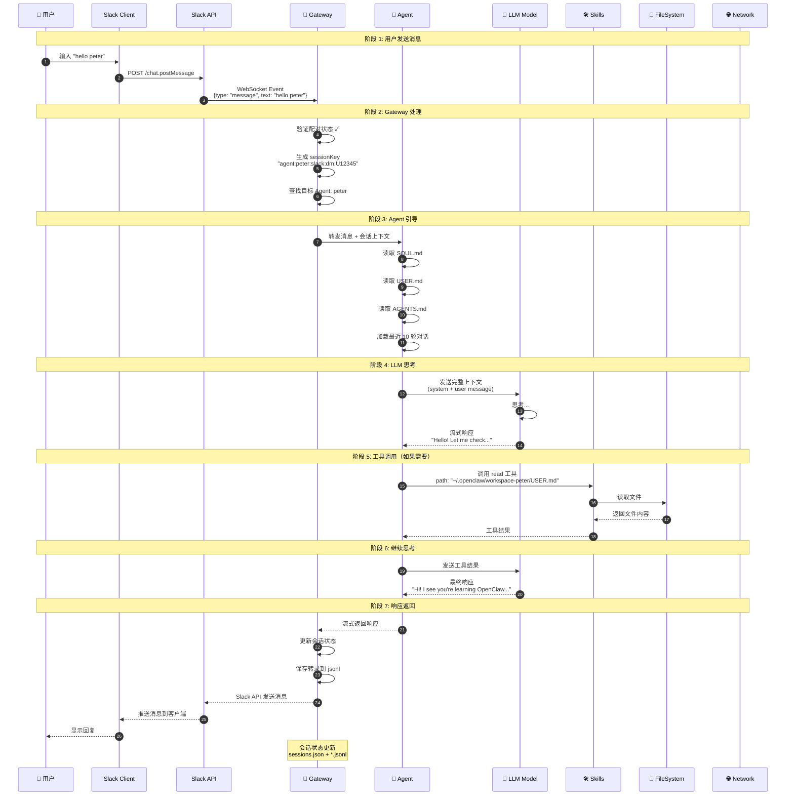
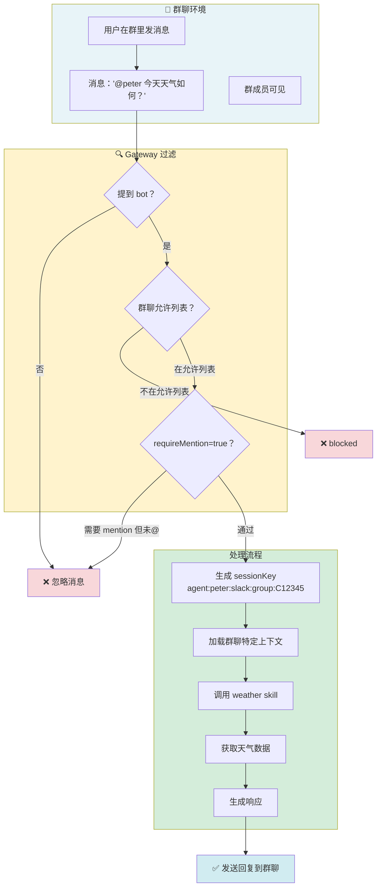
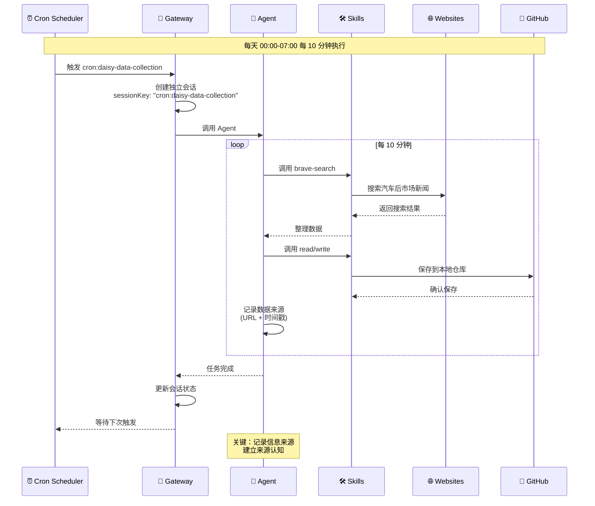
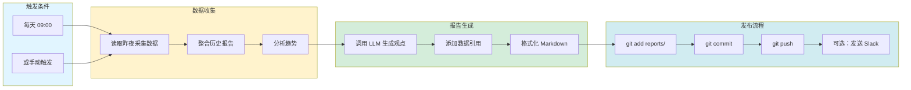
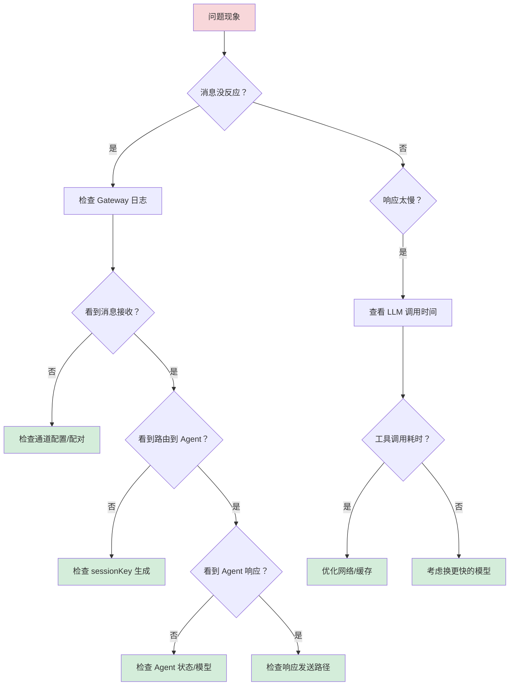

# 附录 A：完整数据流转图 🗺️

> "一图胜千言" - 这里是 OpenClaw 全链路数据流转的详尽图解

---

## A.1 场景一：Slack 直接消息 → Agent 响应

### 完整流程图（宏观视角）



---

### 详细时序图（微观视角）



---

## A.2 场景二：群聊 @提及 → Agent 响应



---

## A.3 场景三：Cron 定时任务 → 数据采集



---

## A.4 场景四：报告生成 → GitHub 提交



---

## A.5 参与者清单

### 内部参与者

| 参与者 | 职责 | 位置 |
|-------|------|------|
| **Gateway** | 消息路由、认证、会话管理 | `~/.nvm/versions/node/v24.14.0/lib/node_modules/openclaw/` |
| **Agent** | LLM 调用、上下文管理、工具协调 | 运行时进程 |
| **Skills** | 具体功能实现（read/write/exec/search） | `~/.openclaw/skills/` 或 `<workspace>/skills/` |
| **Sessions** | 会话状态存储 | `~/.openclaw/agents/<id>/sessions/*.jsonl` |
| **Config** | 配置管理 | `~/.openclaw/openclaw.json` |

### 外部参与者

| 参与者 | 作用 | 通信方式 |
|-------|------|---------|
| **Slack API** | 消息收发 | WebSocket/HTTP |
| **WhatsApp Web** | 消息收发 | Baileys 库 |
| **Telegram Bot API** | 消息收发 | HTTP long polling/webhook |
| **LLM Provider** | AI 模型推理 | HTTP API (Qwen/GPT/Claude) |
| **Brave Search** | 网络搜索 | HTTP API |
| **GitHub** | 代码/报告存储 | Git protocol |
| **File System** | 本地文件读写 | 系统调用 |
| **Shell** | 命令执行 | 子进程 |

---

## A.6 数据格式示例

### 1. Slack 消息（入站）

```json
{
  "type": "message",
  "channel": "D0123456789",
  "user": "U05AN0GGM3M",
  "text": "hello peter",
  "ts": "1773068843.931469",
  "client_msg_id": "abc123"
}
```

### 2. Gateway 内部消息

```json
{
  "type": "req",
  "id": "req-123",
  "method": "agent",
  "params": {
    "agentId": "peter",
    "message": "hello peter",
    "sessionId": "agent:peter:slack:dm:U05AN0GGM3M",
    "context": {
      "channel": "slack",
      "chatType": "direct",
      "sender": "daur"
    }
  }
}
```

### 3. Agent 上下文（发送给 LLM）

```json
{
  "system": "# SOUL.md\n你是 Peter，OpenClaw 的创作者...\n\n# USER.md\n用户：老鄂，程序员...",
  "messages": [
    {"role": "user", "content": "hello peter", "timestamp": "2026-03-09T23:07:25+08:00"}
  ],
  "tools": ["read", "write", "exec", "brave-search"],
  "workspace": "/home/openclaw/.openclaw/workspace-peter"
}
```

### 4. 工具调用

```json
{
  "name": "read",
  "arguments": {
    "path": "/home/openclaw/.openclaw/workspace-peter/USER.md"
  }
}
```

### 5. 工具结果

```json
{
  "name": "read",
  "result": "# USER.md - About Your Human\n- Name: 老鄂\n- Timezone: Asia/Shanghai...",
  "success": true
}
```

### 6. 会话转录（jsonl 格式）

```jsonl
{"role":"user","content":"hello peter","timestamp":"2026-03-09T23:07:25+08:00"}
{"role":"assistant","content":"嗨，老鄂！🦞 有什么可以帮你的？","timestamp":"2026-03-09T23:07:28+08:00"}
{"role":"tool","name":"read","result":"...","timestamp":"2026-03-09T23:07:29+08:00"}
```

---

## A.7 性能指标

### 典型延迟分解

```
用户发送 → Gateway 接收：     50-200ms  (网络延迟)
Gateway 认证 + 路由：         5-20ms    (内存操作)
Agent 上下文注入：            10-50ms   (文件读取)
LLM 思考 + 生成：             500-5000ms (模型推理)
工具调用（如 read）：         10-100ms  (磁盘 I/O)
工具调用（如 search）：       200-2000ms (网络请求)
响应返回 → 用户收到：         50-200ms  (网络延迟)

总计（简单消息）：            600-1000ms
总计（带工具调用）：          1000-5000ms
```

### 会话存储大小

```
典型会话（100 轮对话）：       50-200KB
每日新增（活跃用户）：         20-50KB
月度会话（30 天）：            1-5MB
```

---

## A.8 故障点诊断

### 常见问题定位



---

_这份附录应该让你对 OpenClaw 的数据流转有全景认知。有任何不清楚的地方，Slack 问我！🦞_
