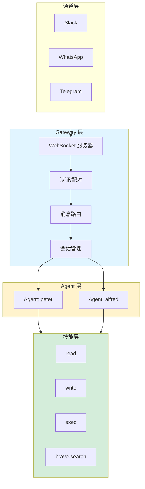
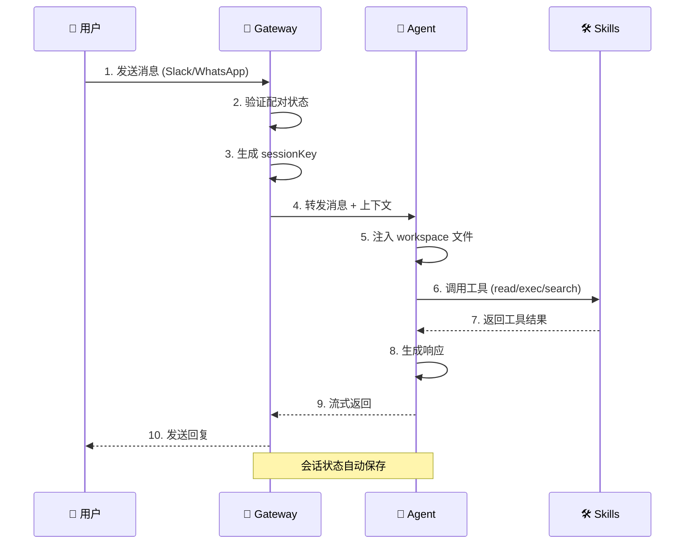

# 第 0 章：准备工作 🎒

> "工欲善其事，必先利其器"
>
> 💡 **本章预计耗时：** 2-3 小时（阅读 + 实践）

---

## 📋 本章目标

学完本章后，你将：
- ✅ 确认 OpenClaw 环境已就绪
- ✅ 理解核心概念术语
- ✅ 知道如何提问和调试
- ✅ 建立学习预期
- ✅ 了解完整的数据流转路径

---

## 0.1 环境检查清单

### 第一步：确认 OpenClaw 已安装

```bash
# 检查版本
openclaw --version

# 应该看到类似：openclaw x.x.x
```

**预期结果：** 显示版本号（例如 `openclaw 1.2.3`）

**如果没安装：**
```bash
npm install -g openclaw@latest
```

---

### 第二步：检查 Gateway 状态

```bash
# 检查 Gateway 是否运行
openclaw gateway status
```

**预期结果：**
```
Gateway Status: running
Port: 18789
Bind: loopback
Auth: token
Uptime: 2d 3h 15m
```

**如果没运行：**
```bash
# 启动 Gateway
openclaw gateway start

# 或者前台运行（调试用）
openclaw gateway
```

---

### 第三步：确认 Agent 配置

```bash
# 查看配置的 Agents
openclaw status
```

**你应该看到：**
- 至少一个 Agent（例如 `peter`, `alfred`, `main`）
- 每个 Agent 的工作空间路径
- 会话存储位置

---

### 第四步：测试消息通道

```bash
# 发送测试消息（根据你的通道选择）
# 例如：Slack
# 在你的 Slack 里给 bot 发消息："hello"

# 或者用 CLI 测试
openclaw gateway call agent --agent-id peter --message "hello"
```

**预期结果：** 收到 Agent 的回复

---

## 0.2 核心概念速览

在深入之前，先快速了解这些术语：

### Gateway 🦞

```
┌─────────────────────────────────┐
│         Gateway                 │
│  - WebSocket 服务器 (18789 端口)   │
│  - 消息路由中枢                  │
│  - 会话状态管理者                │
│  - 通道连接器 (Slack/WhatsApp 等) │
└─────────────────────────────────┘
```

**一句话：** Gateway 是 OpenClaw 的"心脏"，所有消息都经过它。

---

### Agent 🤖

```
┌─────────────────────────────────┐
│         Agent                   │
│  - AI 大脑 (LLM)                 │
│  - 工作空间 (workspace)          │
│  - 会话历史 (sessions)           │
│  - 技能集合 (skills)             │
└─────────────────────────────────┘
```

**一句话：** Agent 是和你对话的"人格"，有独立的记忆和工具。

---

### Session 💬

```
sessionKey 示例：
- agent:peter:main              (DM 默认会话)
- agent:peter:slack:dm:U12345   (DM 隔离模式)
- agent:peter:slack:group:C67890 (群聊会话)
- cron:daisy-daily-report       (Cron 任务会话)
```

**一句话：** Session 是对话的"上下文容器"，每次对话都属于某个会话。

---

### Skill 🛠️

```
skill/
├── SKILL.md          # 技能定义（必须）
├── references/       # 参考资料（可选）
└── scripts/          # 脚本文件（可选）
```

**一句话：** Skill 是 Agent 的"超能力"，让 AI 能执行具体任务。

---

### Workspace 📁

```
~/.openclaw/workspace-peter/
├── SOUL.md           # 人格定义
├── AGENTS.md         # 操作指令
├── USER.md           # 用户信息
├── TOOLS.md          # 工具笔记
├── IDENTITY.md       # 身份标识
└── memory/           # 记忆目录
```

**一句话：** Workspace 是 Agent 的"个人空间"，包含所有个性化配置。

---

## 0.3 学习地图

### 整体架构图



---

### 消息流转时序



---

## 0.4 调试工具箱

### 常用命令

```bash
# 查看 Gateway 状态
openclaw gateway status

# 查看会话列表
openclaw sessions --json

# 查看最近的会话（过去 30 分钟活跃）
openclaw sessions --active 30

# 安全审计
openclaw security audit

# 健康检查
openclaw doctor

# 查看日志（实时）
tail -f /tmp/openclaw/openclaw-*.log
```

---

### 聊天中的调试命令

在你的 Slack 里给 bot 发送这些命令：

```
/status      # 查看 Agent 状态和会话信息
/context list    # 查看上下文注入内容
/new         # 重置会话
/stop        # 停止当前运行
/compact     # 压缩上下文
```

---

### 日志位置

```bash
# Gateway 日志
/tmp/openclaw/openclaw-YYYY-MM-DD.log

# 会话记录
~/.openclaw/agents/<agentId>/sessions/*.jsonl

# 配置文件
~/.openclaw/openclaw.json
```

---

## 0.5 如何提问

学习过程中遇到问题？这样提问最高效：

### ✅ 好问题示例

```
问题：Gateway 启动失败
环境：macOS 14, Node 22, openclaw 1.2.3
错误信息：
  Error: Port 18789 is already in use
已尝试：
  - lsof -i :18789 发现被占用
  - kill -9 <PID> 后仍然失败
```

### ❌ 坏问题示例

```
问题：用不了
```

---

### 提问模板

```markdown
## 问题描述
[用一句话说清楚]

## 环境信息
- OS: [macOS/Windows/Linux]
- Node: [node --version]
- OpenClaw: [openclaw --version]

## 错误信息
[完整的错误输出]

## 已尝试的解决方案
1. [尝试 1]
2. [尝试 2]

## 相关配置
[相关的 openclaw.json 片段]
```

---

## 0.6 学习建议

### 🎯 每章学习流程

```
1. 阅读章节内容 (理解概念)
   ↓
2. 查看图表 (建立直观认知)
   ↓
3. 动手实践 (完成练习)
   ↓
4. Slack 讨论 (解决问题)
   ↓
5. 进入下一章
```

---

### 📝 笔记建议

建议你：
1. 在 `memory/` 目录下创建学习笔记
2. 记录踩坑和解决方案
3. 标注不理解的概念（我们讨论）

示例：
```bash
# 创建今日笔记
echo "# 2026-03-09 学习 Gateway 架构" > memory/2026-03-09.md
```

---

### ⏰ 时间管理

```
推荐节奏：
- 每周 1-2 章
- 每章 2-4 小时（阅读 + 实践）
- Slack 讨论：灵活

如果赶时间：
- 优先阅读"核心概念"部分
- 实战练习可以选做
- 图表必看！
```

---

## 0.7 本章实战练习

### 练习 1：环境验证 ✅

完成以下检查并记录结果：

```bash
# 1. 版本号
openclaw --version
# 结果：___________

# 2. Gateway 状态
openclaw gateway status
# 结果：___________

# 3. Agent 列表
openclaw status
# 结果：___________

# 4. 发送测试消息
# 在 Slack 里说："hello peter"
# 收到回复：是/否
```

---

### 练习 2：绘制你的架构图

用 Mermaid 或纸笔，画出你理解的 OpenClaw 架构：

```
[你的消息通道] → [Gateway] → [你的 Agents] → [Skills]
```

不需要完美，先建立直观认知。

---

### 练习 3：提一个问题

在学习过程中，记录至少一个你想知道的问题：

```
我的问题：
_______________________________

（带到下一章，看是否能找到答案）
```

---

## 📚 延伸阅读

- [OpenClaw 官方文档](https://docs.openclaw.ai)
- [Gateway 架构详解](/concepts/architecture.md)
- [安全模型](/gateway/security/index.md)

---

## 🎓 下一章预告

**第 1 章：Gateway 架构详解**

我们将深入 Gateway 内部，了解：
- WebSocket 协议是如何工作的
- 消息是如何路由到正确 Agent 的
- 会话状态是如何管理的
- 事件驱动模型的优势

---

_完成练习后，Slack 告诉我，我们继续下一章！🦞_
