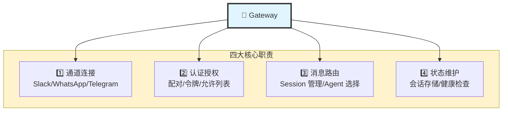
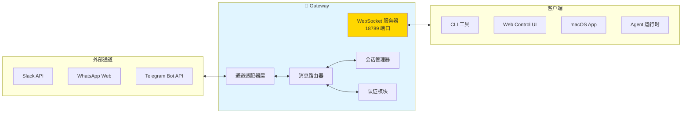
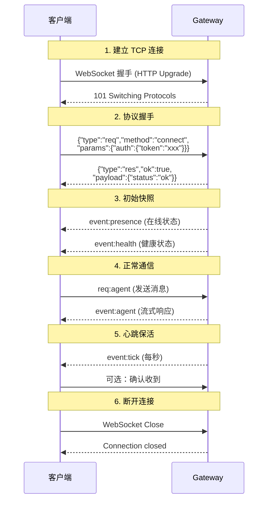
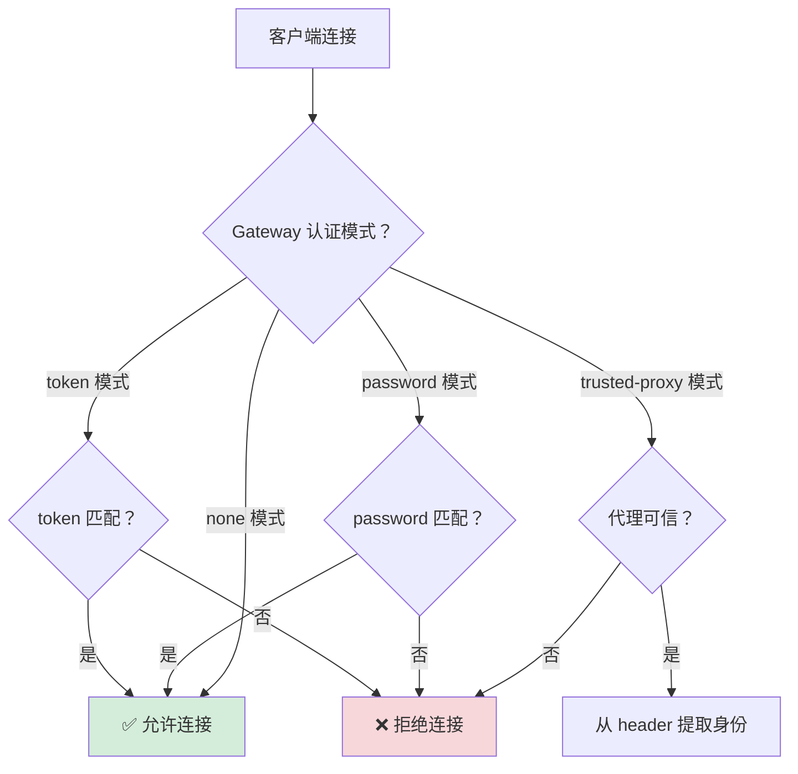
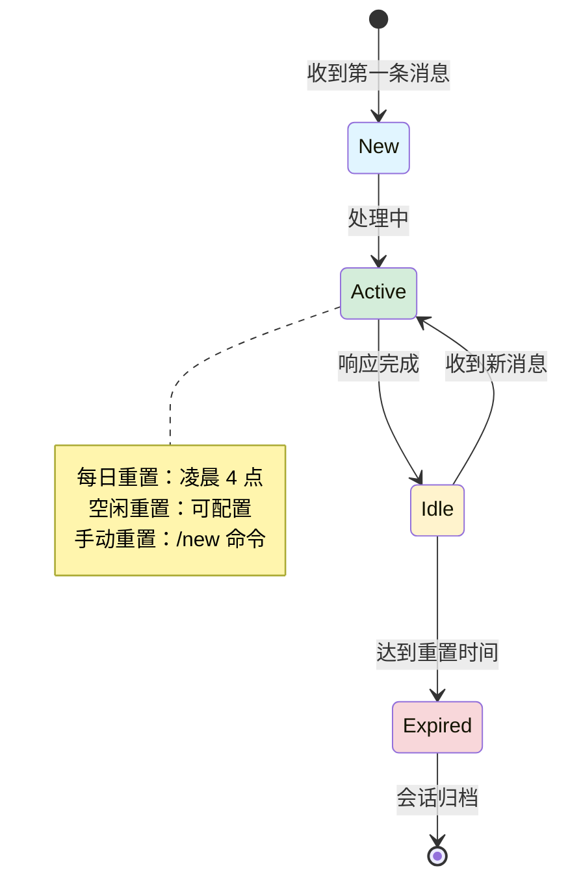

# 第 1 章：Gateway 架构详解 🦞

> "Gateway 是 OpenClaw 的心脏"

---

## 📋 本章目标

学完本章后，你将：
- ✅ 理解 Gateway 的核心职责
- ✅ 掌握 WebSocket 协议工作原理
- ✅ 知道消息是如何流转的
- ✅ 能够诊断 Gateway 相关问题

---

## 1.1 Gateway 是什么？

### 一句话定义

**Gateway 是一个长连接的 WebSocket 服务器，它是所有消息表面的统一入口和路由中枢。**

---

### 核心职责



---

### 为什么需要 Gateway？

**问题：** 为什么不直接让 Agent 连接 Slack/WhatsApp？

**答案：** 解耦 + 复用 + 统一管理

```
❌ 没有 Gateway 的情况：
┌─────────┐    ┌──────────┐
│  Agent  │────│  Slack   │
└─────────┘    └──────────┘
┌─────────┐    ┌──────────┐
│  Agent  │────│ WhatsApp │  ← 每个 Agent 都要实现所有通道
└─────────┘    └──────────┘
┌─────────┐    ┌──────────┐
│  Agent  │────│ Telegram │
└─────────┘    └──────────┘

✅ 有 Gateway 的情况：
┌─────────┐         ┌──────────┐
│  Agent  │         │  Slack   │
└────┬────┘         └──────────┘
     │              ┌──────────┐
┌────┴────┐         │ WhatsApp │
│ Gateway │─────────└──────────┘
└────┬────┘         ┌──────────┐
     │              │ Telegram │
┌────┴────┐         └──────────┘
│  Agent  │
└─────────┘

好处：
- Agent 只需要关心"思考"，不用管通道细节
- 新增通道只需修改 Gateway，不影响 Agent
- 统一的认证、会话管理、日志记录
```

---

## 1.2 技术架构

### 组件图



---

### 进程模型

```
OpenClaw Gateway (单进程)
│
├── WebSocket 服务器 (18789)
│   ├── 处理客户端连接
│   ├── 认证握手
│   └── 事件推送
│
├── 通道连接
│   ├── Slack RTM/Events API
│   ├── WhatsApp Web (Baileys)
│   ├── Telegram Bot (grammY)
│   └── Discord/其他...
│
├── 会话存储
│   ├── sessions.json (元数据)
│   └── *.jsonl (转录记录)
│
└── 定时任务
    ├── 心跳检查
    ├── Cron 调度
    └── 会话维护
```

**关键点：** Gateway 是**单线程事件循环**，所有 I/O 都是异步的。

---

## 1.3 WebSocket 协议

### 连接生命周期



---

### 帧格式

**请求帧：**
```json
{
  "type": "req",
  "id": "unique-request-id",
  "method": "agent",
  "params": {
    "agentId": "peter",
    "message": "hello",
    "sessionId": "abc123"
  }
}
```

**响应帧：**
```json
{
  "type": "res",
  "id": "unique-request-id",
  "ok": true,
  "payload": {
    "runId": "run-456",
    "status": "accepted"
  }
}
```

**事件帧（服务器推送）：**
```json
{
  "type": "event",
  "event": "agent",
  "payload": {
    "runId": "run-456",
    "delta": "Hello! How can I help?",
    "type": "text"
  }
}
```

---

### 认证机制



**配置示例：**
```json5
// ~/.openclaw/openclaw.json
{
  gateway: {
    auth: {
      mode: "token",
      token: "your-secret-token"  // 或用环境变量
    }
  }
}
```

---

## 1.4 消息路由

### 路由决策流程

```mermaid
flowchart TD
    Start[收到消息] --> Step1{消息来源？}
    
    Step1 -->|DM 直接消息 | DMRoute[检查 dmScope 配置]
    Step1 -->|群聊 | GroupRoute[检查群聊策略]
    Step1 -->|Cron | CronRoute[cron:<jobId>]
    Step1 -->|Webhook | HookRoute[hook:<uuid>]
    
    DMRoute --> DMCheck{dmScope 值？}
    DMCheck -->|main| Key1["agent:<id>:main"]
    DMCheck -->|per-peer| Key2["agent:<id>:dm:<senderId>"]
    DMCheck -->|per-channel-peer| Key3["agent:<id>:<channel>:dm:<senderId>"]
    
    GroupRoute --> GroupCheck{mention 要求？}
    GroupCheck -->|需要 mention | MentionCheck{被@了？}
    MentionCheck -->|是 | Key4["agent:<id>:<channel>:group:<groupId>"]
    MentionCheck -->|否 | Ignore[❌ 忽略消息]
    GroupCheck -->|无需 mention | Key4
    
    Key1 --> SelectAgent[选择 Agent]
    Key2 --> SelectAgent
    Key3 --> SelectAgent
    Key4 --> SelectAgent
    CronRoute --> SelectAgent
    HookRoute --> SelectAgent
    
    SelectAgent --> Forward[转发到 Agent 运行时]
    
    style Key1 fill:#e1f5ff
    style Key2 fill:#e1f5ff
    style Key3 fill:#e1f5ff
    style Key4 fill:#e1f5ff
    style Ignore fill:#f8d7da
```

---

### sessionKey 生成规则

| 消息类型 | dmScope 配置 | sessionKey 格式 | 示例 |
|---------|------------|----------------|------|
| DM | `main` (默认) | `agent:<id>:main` | `agent:peter:main` |
| DM | `per-peer` | `agent:<id>:dm:<senderId>` | `agent:peter:dm:U12345` |
| DM | `per-channel-peer` | `agent:<id>:<channel>:dm:<senderId>` | `agent:peter:slack:dm:U12345` |
| 群聊 | - | `agent:<id>:<channel>:group:<groupId>` | `agent:peter:slack:group:C67890` |
| Cron | - | `cron:<jobId>` | `cron:daisy-daily-report` |
| Webhook | - | `hook:<uuid>` | `hook:550e8400-e29b-41d4-a716-446655440000` |

---

## 1.5 会话管理

### 存储结构

```
~/.openclaw/agents/<agentId>/sessions/
│
├── sessions.json           # 会话元数据（所有会话索引）
│   └── {
│         "agent:peter:main": {
│           "sessionId": "abc123",
│           "updatedAt": "2026-03-09T15:23:00Z",
│           "inputTokens": 1234,
│           "outputTokens": 5678,
│           "origin": {...}
│         },
│         ...
│       }
│
└── abc123.jsonl            # 会话转录（对话历史）
    └── 每行一个 JSON 对象：
        {"role":"user","content":"hello","timestamp":"..."}
        {"role":"assistant","content":"Hi!","timestamp":"..."}
        {"role":"tool","name":"read","result":"...","timestamp":"..."}
```

---

### 会话生命周期



---

### 会话重置策略

```json5
{
  session: {
    // 默认：每天凌晨 4 点重置
    reset: {
      mode: "daily",
      atHour: 4,
      idleMinutes: 120  // 可选：空闲 2 小时也重置
    },
    
    // 按会话类型分别配置
    resetByType: {
      direct: { mode: "idle", idleMinutes: 240 },
      group: { mode: "idle", idleMinutes: 120 },
      thread: { mode: "daily", atHour: 4 }
    },
    
    // 按通道覆盖
    resetByChannel: {
      discord: { mode: "idle", idleMinutes: 10080 }  // 7 天
    }
  }
}
```

---

## 1.6 事件驱动模型

### Gateway 事件类型

| 事件名 | 触发时机 |  payload 内容 |
|-------|---------|--------------|
| `presence` | 连接建立/状态变化 | 在线状态、设备信息 |
| `health` | 健康状态更新 | Gateway 健康度、资源使用 |
| `tick` | 每秒心跳 | 时间戳、序列号 |
| `agent` | Agent 响应 | 流式文本、工具调用、最终结果 |
| `chat` | 聊天历史更新 | 消息内容、发送者 |
| `cron` | Cron 任务执行 | 任务 ID、执行结果 |
| `heartbeat` | 心跳检查 | 存活确认 |

---

### 事件订阅模式

```mermaid
flowchart LR
    GW[Gateway]
    
    subgraph Subscribers["订阅者"]
        CLI[CLI 客户端]
        WebUI[Web UI]
        macOS[macOS App]
    end
    
    GW -->|event:tick| CLI
    GW -->|event:tick| WebUI
    GW -->|event:tick| macOS
    GW -->|event:agent| CLI
    GW -->|event:agent| WebUI
    GW -->|event:presence| CLI
    GW -->|event:presence| macOS
    
    Note over GW: 广播模式<br/>所有订阅者都收到
    
    style GW fill:#e1f5ff
```

---

## 1.7 实战：诊断 Gateway 问题

### 问题 1：Gateway 无法启动

**症状：**
```bash
$ openclaw gateway start
Error: Port 18789 is already in use
```

**诊断步骤：**
```bash
# 1. 查看谁占用了端口
lsof -i :18789

# 2. 如果是旧的 Gateway 进程
kill -9 <PID>

# 3. 或者换个端口
openclaw gateway --port 18790
```

---

### 问题 2：客户端无法连接

**症状：**
```bash
$ openclaw status
Error: WebSocket connection failed
```

**诊断步骤：**
```bash
# 1. 检查 Gateway 是否运行
openclaw gateway status

# 2. 检查认证配置
cat ~/.openclaw/openclaw.json | grep -A 3 auth

# 3. 测试本地连接
curl http://127.0.0.1:18789/health

# 4. 查看日志
tail -f /tmp/openclaw/openclaw-*.log
```

---

### 问题 3：消息不响应

**症状：** Slack 发消息，Agent 没反应

**诊断步骤：**
```bash
# 1. 检查配对状态
openclaw pairing list slack

# 2. 查看会话是否创建
openclaw sessions --active 5

# 3. 检查 Agent 状态
openclaw status

# 4. 查看 Gateway 日志
grep "U12345" /tmp/openclaw/openclaw-*.log  # 替换为你的 Slack ID
```

---

## 1.8 本章实战练习

### 练习 1：绘制你的 Gateway 架构图 🎨

用 Mermaid 或纸笔，画出你理解的 Gateway 架构，包括：
- 外部通道（Slack/WhatsApp 等）
- Gateway 核心组件
- 客户端（CLI/Web/App）
- Agent 运行时

---

### 练习 2：追踪一次消息流转 🔍

1. 在 Slack 给你的 bot 发消息："test gateway"
2. 同时打开终端，实时查看日志：
   ```bash
   tail -f /tmp/openclaw/openclaw-*.log
   ```
3. 记录你看到的日志输出顺序

**预期看到：**
```
[INFO] Received message from U12345
[INFO] Session key: agent:peter:slack:dm:U12345
[INFO] Routing to agent: peter
[INFO] Agent response generated
```

---

### 练习 3：修改 Gateway 配置 ⚙️

1. 编辑 `~/.openclaw/openclaw.json`
2. 尝试修改以下配置：
   ```json5
   {
     gateway: {
       port: 18790,  // 改端口
       auth: {
         mode: "token",
         token: "new-test-token"  // 改令牌
       }
     }
   }
   ```
3. 重启 Gateway
4. 用新配置连接

---

### 练习 4：查看会话存储 💾

```bash
# 1. 列出所有会话文件
ls -la ~/.openclaw/agents/peter/sessions/

# 2. 查看 sessions.json 内容
cat ~/.openclaw/agents/peter/sessions/sessions.json | jq

# 3. 查看一个会话转录
head -20 ~/.openclaw/agents/peter/sessions/*.jsonl
```

记录你看到的内容结构。

---

## 📚 延伸阅读

- [Gateway 协议详解](/gateway/protocol)
- [会话管理](/concepts/session)
- [安全配置](/gateway/security)

---

## 🎓 下一章预告

**第 2 章：Agent 运行时**

我们将深入 Agent 内部，了解：
- Workspace 文件是如何注入的
- 会话是如何引导启动的
- 工具调用的完整链路
- SOUL.md 如何影响 Agent 行为

---

_完成练习后，Slack 告诉我，我们继续下一章！🦞_
