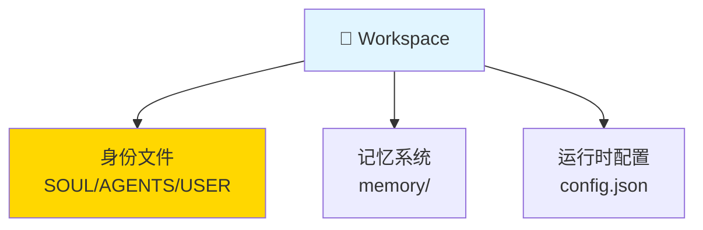
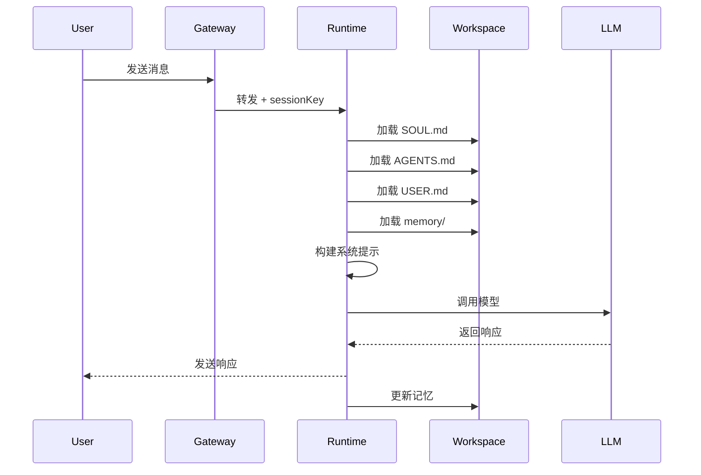
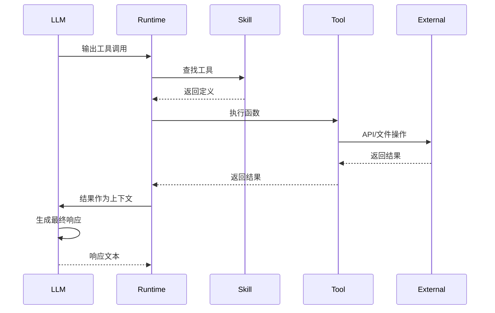

# 第 2 章：Agent 运行时 🦞

> "Agent 是 OpenClaw 的大脑，Workspace 是它的记忆"

---

## 📋 本章目标

学完本章后，你将：
- ✅ 理解 Workspace 文件注入机制
- ✅ 掌握会话引导流程
- ✅ 知道工具调用的完整链路
- ✅ 能够配置运行时参数
- ✅ 通过修改 SOUL.md 改变 Agent 行为

---

## 2.1 Workspace 是什么？

### 一句话定义

**Workspace 是 Agent 的"家"——一个包含身份、记忆、工具和规则的目录结构。**

---

### 为什么需要 Workspace？

```
❌ 没有 Workspace：所有 Agent 共用配置，一个出错全部受影响

✅ 有 Workspace：每个 Agent 独立，隔离 + 个性化 + 安全
```

---

### Workspace 目录结构



---

### 实际目录示例

```bash
$ tree -L 2 ~/.openclaw/workspace-peter/

/workspace-peter/
├── SOUL.md           # 人格定义
├── AGENTS.md         # 会话规则
├── USER.md           # 用户信息
├── TOOLS.md          # 本地笔记
├── config.json       # 运行时配置
├── memory/           # 每日记忆
│   ├── 2026-03-09.md
│   └── 2026-03-10.md
└── curated/          # 精选记忆
```

---

## 2.2 核心文件详解

### SOUL.md - Agent 的人格

**位置：** `~/.openclaw/workspace-<name>/SOUL.md`

```markdown
# SOUL.md - Who You Are

## Core Identity
**你是 OpenClaw 的创作者。**

## Core Truths
**Build things that matter.**
**Explain the why, not just the how.**

## Vibe
- 直接但不冷漠
- 务实但不无聊

## Boundaries
- 不假装知道不知道的事
- 不推荐不安全的做法
```

**💡 关键点：** 思维方式的引导，不是角色扮演剧本。

---

### AGENTS.md - 会话规则

```markdown
## Session Rules
1. Read SOUL.md first
2. Read USER.md
3. Check memory/
4. Teach, don't just answer
```

---

### USER.md - 用户信息（动态更新）

```markdown
# USER.md - About Your Human
- **Name:** 老鄂
- **Timezone:** Asia/Shanghai

## Learning Goals
1. OpenClaw 架构设计
2. 如何创建 Agent
```

---

## 2.3 会话引导流程



---

### 文件加载优先级

```
1. SOUL.md (人格定义)
   ↓
2. AGENTS.md (会话规则)
   ↓
3. USER.md (用户信息)
   ↓
4. TOOLS.md (本地配置)
   ↓
5. memory/today.md (今日记忆)
   ↓
6. 技能 SKILL.md (工具定义)
   ↓
7. 合并为系统提示
```

---

### 系统提示结构

```
<system>
# SOUL.md
[完整内容]

# AGENTS.md
[完整内容]

# USER.md
[完整内容]

# memory/today.md
[今日记忆]

# Available Tools
[工具列表]

# Context
- Session: agent:peter:main
- Time: 2026-03-10 14:30
- Model: qwen3.5-plus
</system>

<user>
你好
</user>
```

---

## 2.4 工具调用链路



---

## 2.5 运行时配置

### 配置文件位置

`~/.openclaw/agents/<agentId>/config.json`

### 核心参数

```json5
{
  model: "qwen3.5-plus",
  default_model: "qwen3.5-plus",
  
  thinking: true,
  thinking_budget: 10000,
  
  temperature: 0.7,
  max_tokens: 4096,
  top_p: 0.9,
  
  context_window: 128000,
  
  session: {
    reset: {
      mode: "daily",
      atHour: 4
    }
  }
}
```

### 参数说明

| 参数 | 含义 | 推荐值 |
|------|------|--------|
| `thinking` | 启用思考过程 | true/false |
| `temperature` | 创造性程度 | 0.7 |
| `max_tokens` | 响应上限 | 4096 |
| `thinking_budget` | 思考 token 预算 | 10000 |

---

## 2.6 实战：修改 SOUL.md

### 步骤

```bash
# 1. 记录当前行为
/ask peter "如何学习 OpenClaw？"

# 2. 修改 SOUL.md
nano ~/.openclaw/workspace-peter/SOUL.md

# 添加一行：
## New Rule
**Always start responses with "🦞 OpenClaw says:"**

# 3. 重置会话测试
/new
/ask peter "如何学习 OpenClaw？"

# 4. 观察变化
# 预期：回答以 "🦞 OpenClaw says:" 开头

# 5. 恢复原状
# 删除添加的行
```

---

## 2.7 故障诊断

### 问题 1：修改 SOUL.md 后无变化

**症状：** 改了 SOUL.md，Agent 行为不变

**原因：** 会话未重置，仍使用旧的系统提示

**解决：**
```bash
# 方法 1：重置会话
/new

# 方法 2：重启 Agent
openclaw agent restart peter
```

---

### 问题 2：工具调用失败

**症状：** Agent 说"无法执行此操作"

**诊断：**
```bash
# 1. 检查技能是否加载
openclaw skills list

# 2. 查看工具定义
cat ~/.nvm/.../skills/<skill>/tools/*

# 3. 检查权限
openclaw pairing list
```

**解决：**
```bash
# 重新加载技能
openclaw skills reload

# 或重启 Agent
openclaw agent restart peter
```

---

### 问题 3：记忆文件过大

**症状：** 响应变慢，token 消耗高

**诊断：**
```bash
# 查看记忆文件大小
ls -lh ~/.openclaw/workspace-peter/memory/

# 查看会话转录
wc -l ~/.openclaw/agents/peter/sessions/*.jsonl
```

**解决：**
```bash
# 重置会话
/new

# 或清理旧记忆
rm ~/.openclaw/workspace-peter/memory/2026-02-*.md
```

---

### 问题 4：配置文件语法错误

**症状：** Agent 无法启动，报错 JSON parse error

**诊断：**
```bash
# 验证 JSON 语法
cat ~/.openclaw/agents/peter/config.json | jq .
```

**解决：**
```bash
# 编辑修复
nano ~/.openclaw/agents/peter/config.json

# 或恢复默认
cp ~/.nvm/.../openclaw/defaults/config.json \
   ~/.openclaw/agents/peter/config.json
```

---

## 2.8 本章实战练习

### 练习 1：绘制你的 Workspace 结构 🎨

```bash
# 列出你的 Workspace 文件
tree -L 2 ~/.openclaw/workspace-peter/

# 用 Mermaid 画出结构
# 对比本章的示例图
```

**目标：** 理解你的 Workspace 包含哪些文件。

---

### 练习 2：追踪一次完整对话 🔍

```bash
# 1. 开启新会话
/new

# 2. 发送消息
/ask peter "test"

# 3. 同时查看日志
tail -f /tmp/openclaw/*.log

# 4. 记录文件加载顺序
# 预期看到：
# - Loading SOUL.md
# - Loading AGENTS.md
# - Loading USER.md
# - Building system prompt
```

**目标：** 理解会话引导流程。

---

### 练习 3：创建个性化 SOUL ✍️

为你的学习 Agent 创建独特人格：

```markdown
# 在你的 SOUL.md 中添加

## Core Identity
[定义 3 个核心特质]

## Vibe
[描述说话风格]

## Special Habit
[添加 1 个特殊习惯，如用 emoji]
```

**测试：**
```bash
/new
/ask peter "介绍一下你自己"
```

**目标：** 体验 SOUL.md 对行为的影响。

---

### 练习 4：配置运行时参数 ⚙️

```bash
# 1. 查看当前配置
cat ~/.openclaw/agents/peter/config.json | jq

# 2. 修改 temperature
# 编辑 config.json: "temperature": 0.3

# 3. 测试
/ask peter "写一首诗"

# 4. 改回 0.9 再测试
# 对比两次响应的差异
```

**目标：** 理解参数对响应的影响。

---

### 练习 5：查看工具调用链路 🛠️

```bash
# 1. 启用详细日志
export OPENCLAW_DEBUG=1

# 2. 执行工具调用
/ask peter "读取 /etc/hostname 的内容"

# 3. 查看日志中的工具调用
grep "tool" /tmp/openclaw/*.log | tail -20

# 4. 记录你看到的步骤
# 预期：
# - Tool lookup: read
# - Tool execution: read({"path": "/etc/hostname"})
# - Tool result: ...
```

**目标：** 理解工具调用的完整流程。

---

## 📚 延伸阅读

- [SOUL.md 规范](/concepts/soul)
- [工具系统](/concepts/tools)
- [会话管理](/concepts/session)

---

## 🎓 下一章预告

**第 3 章：会话管理**

我们将深入：
- sessionKey 生成算法
- DM/群聊隔离策略
- 会话存储结构
- 多会话管理

---

_完成练习后，我们继续下一章！🦞_
