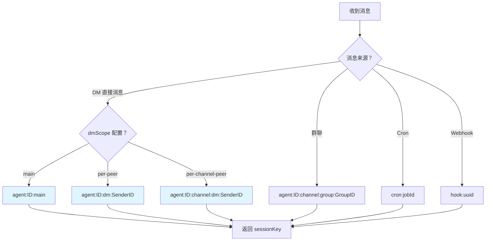
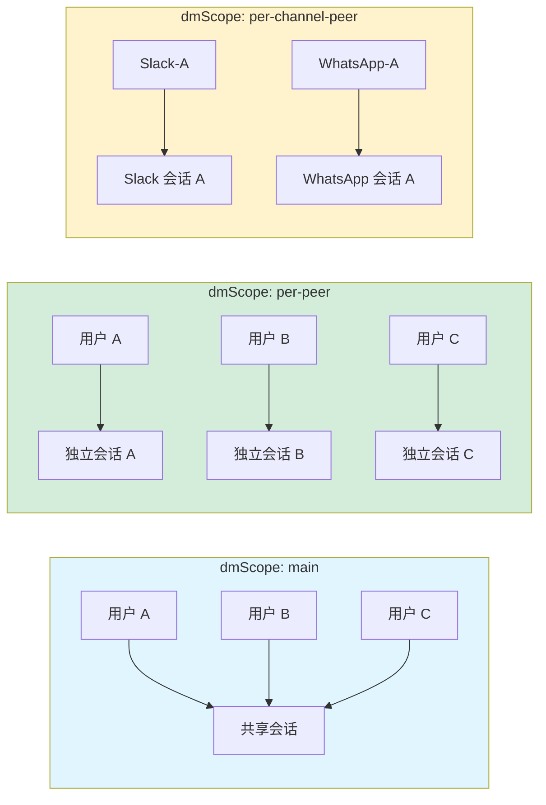
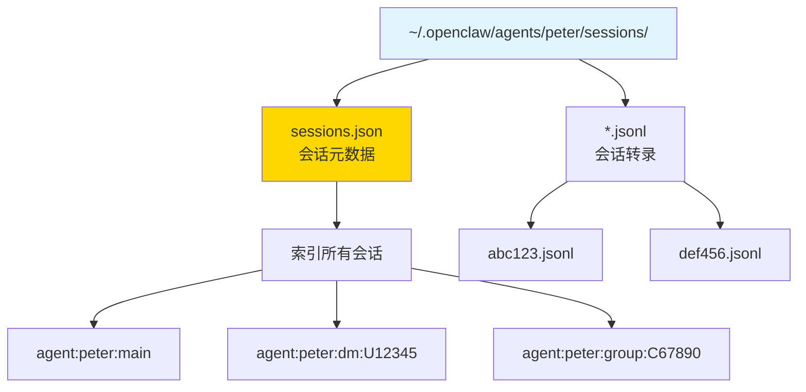
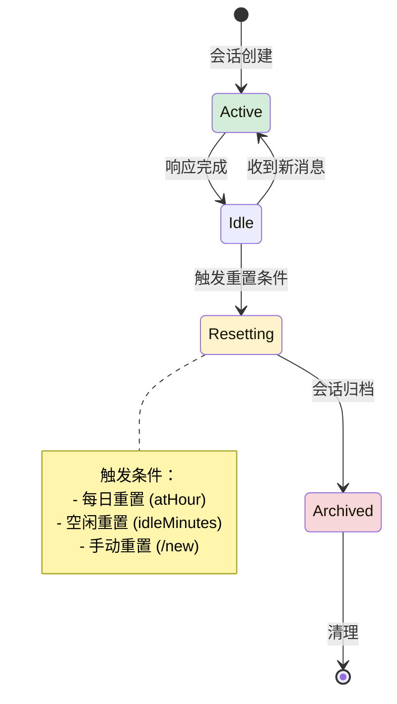

# 第 3 章：会话管理 🦞

> "会话是 OpenClaw 的记忆单元，sessionKey 是它的身份证"

---

## 📋 本章目标

学完本章后，你将：
- ✅ 理解 sessionKey 生成算法
- ✅ 掌握 DM/群聊/线程隔离策略
- ✅ 知道会话存储结构
- ✅ 能够配置会话重置策略
- ✅ 管理多会话

---

## 3.1 sessionKey 是什么？

### 一句话定义

**sessionKey 是会话的唯一标识符，它决定了消息如何被隔离和存储。**

---

### 为什么需要 sessionKey？

**问题：** 为什么不用简单的会话 ID？

**答案：** sessionKey 包含**路由信息**，不仅仅是标识符

```
普通会话 ID:     "abc123"  → 只知道是哪个会话
sessionKey:      "agent:peter:slack:dm:U12345"  → 知道：
                                   - 哪个 Agent (peter)
                                   - 哪个通道 (slack)
                                   - 哪种类型 (dm)
                                   - 哪个用户 (U12345)
```

---

### sessionKey 生成算法



---

### sessionKey 格式详解

| 消息类型 | dmScope | sessionKey 格式 | 示例 |
|---------|---------|----------------|------|
| DM | `main` (默认) | `agent:<id>:main` | `agent:peter:main` |
| DM | `per-peer` | `agent:<id>:dm:<senderId>` | `agent:peter:dm:U12345` |
| DM | `per-channel-peer` | `agent:<id>:<channel>:dm:<senderId>` | `agent:peter:slack:dm:U12345` |
| 群聊 | - | `agent:<id>:<channel>:group:<groupId>` | `agent:peter:slack:group:C67890` |
| Cron | - | `cron:<jobId>` | `cron:daily-report` |
| Webhook | - | `hook:<uuid>` | `hook:550e8400-e29b` |
| 线程 | - | `agent:<id>:<channel>:thread:<threadId>` | `agent:peter:slack:thread:T123` |

---

## 3.2 DM/群聊/线程隔离策略

### DM 隔离策略



---

### 配置示例

```json5
// ~/.openclaw/agents/peter/config.json
{
  session: {
    // DM 隔离策略
    dmScope: "per-peer",  // main | per-peer | per-channel-peer
    
    // 群聊策略
    group: {
      requireMention: true,  // 需要@才响应
      ignoreBots: true       // 忽略其他 bot
    },
    
    // 线程策略
    thread: {
      enabled: true,         // 启用线程支持
      scope: "per-thread"    // per-thread | per-channel
    }
  }
}
```

---

### 隔离策略对比

| 策略 | 优点 | 缺点 | 适用场景 |
|------|------|------|----------|
| `main` | 简单，记忆共享 | 用户间无隔离 | 个人使用 |
| `per-peer` | 用户隔离，记忆独立 | 会话数量多 | 多用户服务 |
| `per-channel-peer` | 完全隔离 | 会话非常多 | 跨通道服务 |

---

## 3.3 会话存储结构

### 文件系统布局



---

### sessions.json 结构

```json
{
  "agent:peter:main": {
    "sessionId": "abc123",
    "createdAt": "2026-03-01T00:00:00Z",
    "updatedAt": "2026-03-10T14:30:00Z",
    "inputTokens": 12345,
    "outputTokens": 6789,
    "messageCount": 42,
    "origin": {
      "channel": "slack",
      "type": "dm",
      "senderId": "U12345"
    }
  },
  "agent:peter:dm:U12345": {
    "sessionId": "def456",
    "createdAt": "2026-03-05T10:00:00Z",
    "updatedAt": "2026-03-10T15:00:00Z",
    "inputTokens": 5000,
    "outputTokens": 3000,
    "messageCount": 15,
    "origin": {
      "channel": "slack",
      "type": "dm",
      "senderId": "U12345"
    }
  }
}
```

---

### jsonl 转录格式

```jsonl
{"role":"user","content":"你好","timestamp":"2026-03-10T14:00:00Z","senderId":"U12345"}
{"role":"assistant","content":"你好！有什么可以帮你的？","timestamp":"2026-03-10T14:00:05Z"}
{"role":"tool","name":"read","args":{"path":"test.txt"},"result":"file content","timestamp":"2026-03-10T14:00:10Z"}
{"role":"assistant","content":"文件内容是...","timestamp":"2026-03-10T14:00:15Z"}
```

**💡 关键点：** 每行一个 JSON 对象，便于流式处理和增量追加。

---

## 3.4 会话重置策略

### 重置模式



---

### 配置示例

```json5
{
  session: {
    // 全局重置策略
    reset: {
      mode: "daily",      // daily | idle | manual
      atHour: 4,          // 凌晨 4 点重置
      idleMinutes: 120    // 空闲 2 小时重置
    },
    
    // 按会话类型配置
    resetByType: {
      direct: { mode: "idle", idleMinutes: 240 },
      group: { mode: "idle", idleMinutes: 120 },
      thread: { mode: "daily", atHour: 4 }
    },
    
    // 按通道覆盖
    resetByChannel: {
      discord: { mode: "idle", idleMinutes: 10080 },  // 7 天
      slack: { mode: "daily", atHour: 4 }
    },
    
    // 按 sessionKey 前缀覆盖
    resetByPrefix: {
      "cron:": { mode: "manual" },  // Cron 会话不自动重置
      "hook:": { mode: "idle", idleMinutes: 60 }
    }
  }
}
```

---

### 重置策略优先级

```
1. resetByPrefix (最高优先级)
   ↓
2. resetByChannel
   ↓
3. resetByType
   ↓
4. reset (默认)
```

---

## 3.5 实战：多会话管理

### 查看会话

```bash
# 列出所有会话
openclaw sessions list

# 查看活跃会话（最近 5 分钟）
openclaw sessions --active 5

# 查看特定会话详情
openclaw sessions show agent:peter:main

# 查看 token 使用
openclaw sessions stats
```

---

### 操作会话

```bash
# 重置会话（清空记忆）
openclaw sessions reset agent:peter:main

# 删除会话
openclaw sessions delete agent:peter:dm:U12345

# 导出会话
openclaw sessions export agent:peter:main > backup.jsonl

# 导入会话
openclaw sessions import backup.jsonl
```

---

### 会话分析

```bash
# 查看 token 使用趋势
openclaw sessions stats --history 7d

# 找出最活跃的会话
openclaw sessions list --sort messages --limit 10

# 查找包含特定内容的会话
openclaw sessions search "OpenClaw" --limit 5
```

---

## 3.6 故障诊断

### 问题 1：会话不重置

**症状：** 配置了每日重置，但会话一直累积

**诊断：**
```bash
# 检查配置
cat ~/.openclaw/agents/peter/config.json | jq .session.reset

# 查看上次重置时间
cat ~/.openclaw/agents/peter/sessions/sessions.json | jq '.["agent:peter:main"].updatedAt'
```

**解决：**
```bash
# 手动触发重置
openclaw sessions reset agent:peter:main

# 检查 Cron 是否运行
openclaw cron list
```

---

### 问题 2：会话隔离失效

**症状：** 不同用户看到彼此的对话

**诊断：**
```bash
# 检查 dmScope 配置
cat ~/.openclaw/agents/peter/config.json | jq .session.dmScope

# 查看 sessionKey 生成
openclaw sessions list --verbose
```

**解决：**
```bash
# 修改为 per-peer
# 编辑 config.json: "dmScope": "per-peer"

# 重启 Agent
openclaw agent restart peter
```

---

### 问题 3：jsonl 文件损坏

**症状：** 会话加载失败，报错 JSON parse error

**诊断：**
```bash
# 检查文件
head -5 ~/.openclaw/agents/peter/sessions/abc123.jsonl

# 验证 JSON
cat ~/.openclaw/agents/peter/sessions/abc123.jsonl | while read line; do echo "$line" | jq . > /dev/null || echo "Invalid: $line"; done
```

**解决：**
```bash
# 备份并重建
cp abc123.jsonl abc123.jsonl.bak
head -n -1 abc123.jsonl.bak > abc123.jsonl  # 删除最后一行

# 或重置会话
openclaw sessions reset agent:peter:main
```

---

## 3.7 本章实战练习

### 练习 1：查看你的会话 📊
```bash
openclaw sessions list
openclaw sessions stats
```
记录会话数量和 token 使用。

---

### 练习 2：修改 dmScope 🔧
```bash
# 1. 当前配置
cat ~/.openclaw/agents/peter/config.json | jq .session.dmScope

# 2. 修改为 per-peer
# 编辑 config.json

# 3. 重启并测试
openclaw agent restart peter

# 4. 观察新会话创建
openclaw sessions --active 1
```

---

### 练习 3：分析会话存储 💾
```bash
# 1. 查看 sessions.json
cat ~/.openclaw/agents/peter/sessions/sessions.json | jq

# 2. 查看 jsonl 转录
head -20 ~/.openclaw/agents/peter/sessions/*.jsonl

# 3. 统计消息数量
wc -l ~/.openclaw/agents/peter/sessions/*.jsonl
```

---

### 练习 4：配置重置策略 ⏰
```bash
# 配置空闲重置
# 编辑 config.json:
{
  session: {
    reset: {
      mode: "idle",
      idleMinutes: 30
    }
  }
}

# 等待 30 分钟不活动
# 检查会话是否重置
```

---

### 练习 5：会话导出备份 💿
```bash
# 导出所有会话
openclaw sessions export-all > backup-$(date +%Y%m%d).jsonl

# 验证备份
head -5 backup-*.jsonl

# 测试恢复（可选）
# openclaw sessions import backup-*.jsonl
```

---

## 📚 延伸阅读

- [会话管理 API](/api/sessions)
- [存储格式规范](/concepts/storage)

---

## 🎓 下一章预告

**第 4 章：技能系统**

- 技能目录结构
- 技能加载顺序
- 工具注册机制
- 创建第一个技能

---

_会话是记忆，技能是能力。下一章我们给 Agent 添加能力！🦞_
