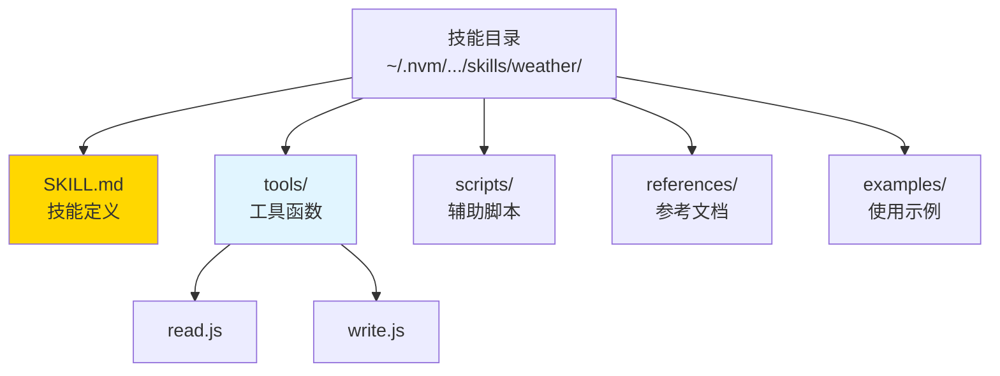
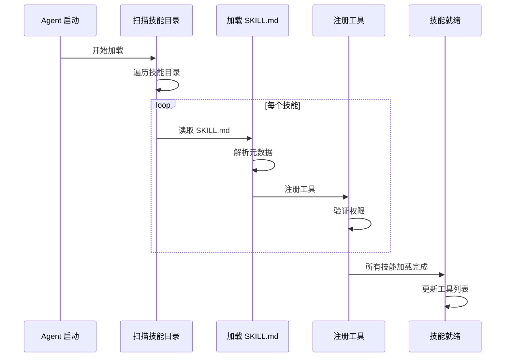
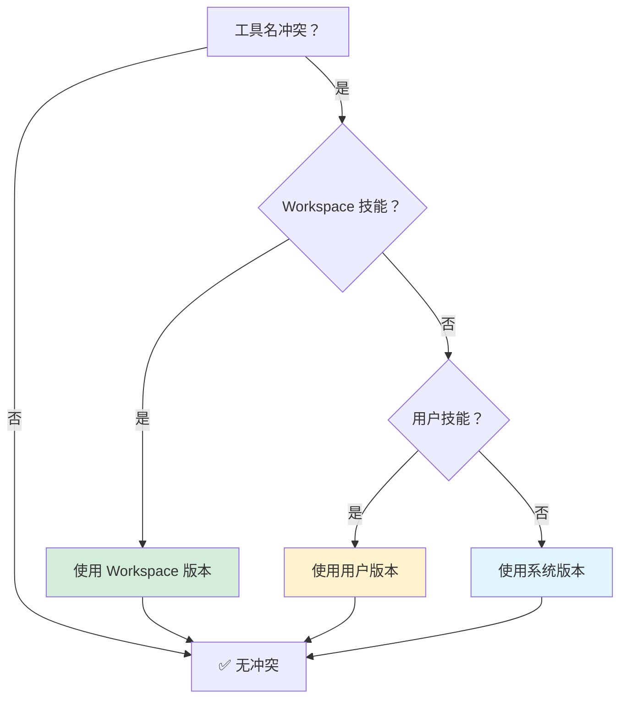
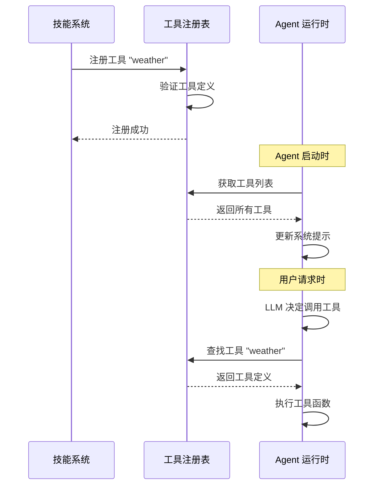
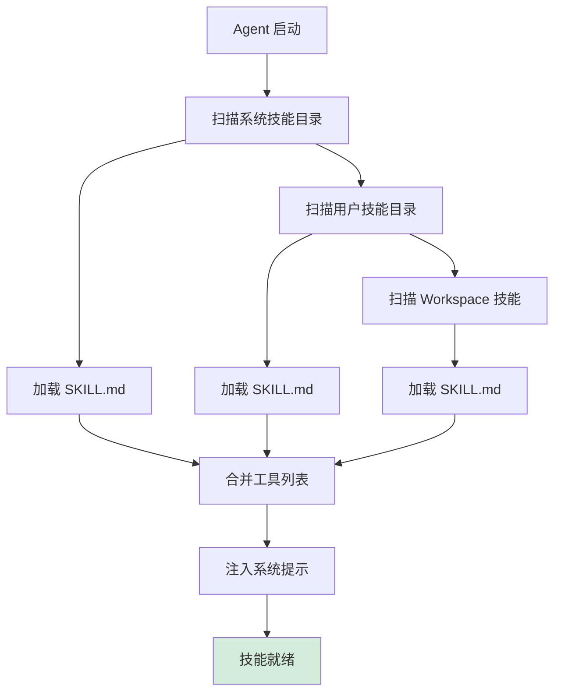

# 第 4 章：技能系统 🦞

> "技能是 OpenClaw 的应用生态，让 AI 能力无限延伸"

---

## 📋 本章目标

学完本章后，你将：
- ✅ 理解技能目录结构
- ✅ 掌握技能加载顺序和优先级
- ✅ 知道工具注册机制
- ✅ 了解技能发现流程
- ✅ 能够创建第一个技能

---

## 4.1 技能是什么？

### 一句话定义

**技能是 OpenClaw 的能力扩展包，它定义了 Agent 可以使用的工具和行为规范。**

---

### 技能 vs 插件

```
❌ 传统插件模式：
┌─────────────┐
│    Agent    │
└──────┬──────┘
       │ 直接调用
       ↓
┌─────────────┐
│   插件 API   │  ← 紧耦合，需要重启
└─────────────┘

✅ OpenClaw 技能模式：
┌─────────────┐
│    Agent    │
└──────┬──────┘
       │ 通过工具调用
       ↓
┌─────────────┐    ┌─────────────┐
│  技能系统   │───→│  工具函数   │
└──────┬──────┘    └─────────────┘
       │
       ↓
┌─────────────┐
│  SKILL.md   │  ← 热加载，无需重启
└─────────────┘
```

---

### 技能的核心价值

1. **能力扩展** - 让 Agent 能读写文件、搜索网络、调用 API
2. **行为规范** - 定义 Agent 在特定场景下如何思考
3. **知识注入** - 提供领域知识和最佳实践
4. **安全隔离** - 通过权限控制保护敏感操作

---

## 4.2 技能目录结构

### 标准结构



---

### 目录说明

| 目录/文件 | 作用 | 必需 |
|----------|------|------|
| `SKILL.md` | 技能定义和元数据 | ✅ 必需 |
| `tools/` | 工具函数实现 | ❌ 可选 |
| `scripts/` | 辅助脚本（Python/Shell） | ❌ 可选 |
| `references/` | 参考文档和资料 | ❌ 可选 |
| `examples/` | 使用示例 | ❌ 可选 |

---

### SKILL.md 结构

```markdown
# skill-name

> 一句话描述技能

## Description

详细描述技能的作用和使用场景。

## Tools

列出技能提供的工具：

- `tool_name` - 工具描述

## Usage

使用示例：

```
/ask agent "使用 tool_name 做某事"
```

## Configuration

配置项（如有）：

```json5
{
  skill_name: {
    api_key: "xxx"
  }
}
```

## Permissions

权限要求：

- read:files
- write:files
- http:external
```

---

## 4.3 技能加载顺序和优先级

### 加载流程



---

### 加载顺序

```
1. 系统技能（~/.nvm/.../openclaw/skills/）
   ↓
2. 用户技能（~/.openclaw/skills/）
   ↓
3. Workspace 技能（~/.openclaw/workspace-<name>/skills/）
```

**💡 关键点：** 后加载的技能可以覆盖先加载的同名工具。

---

### 优先级规则



---

## 4.4 工具注册机制

### 工具定义格式

```javascript
// tools/weather.js
module.exports = {
  name: 'weather',
  description: '获取天气信息',
  
  // 参数定义
  params: {
    location: {
      type: 'string',
      required: true,
      description: '城市名称'
    }
  },
  
  // 执行函数
  async execute(params, context) {
    const { location } = params;
    const response = await fetch(`https://wttr.in/${location}?format=j1`);
    const data = await response.json();
    
    return {
      success: true,
      data: {
        temp: data.current_condition[0].temp_C,
        condition: data.current_condition[0].weatherDesc[0].value
      }
    };
  }
};
```

---

### 工具注册流程



---

### 工具权限

```json5
// SKILL.md 中声明
{
  permissions: [
    "read:files",      // 读取文件
    "write:files",     // 写入文件
    "exec:local",      // 执行本地命令
    "http:external",   // 外部 HTTP 请求
    "network:internal" // 内网访问
  ]
}
```

**💡 关键点：** 权限在配对时授予，未授权的工具调用会被拒绝。

---

## 4.5 技能发现流程

### Agent 如何知道技能？



---

### 查看已加载技能

```bash
# 列出所有技能
openclaw skills list

# 查看技能详情
openclaw skills show weather

# 查看工具列表
openclaw tools list

# 查看工具定义
openclaw tools show weather
```

---

## 4.6 实战：创建第一个技能

### 场景：创建 "hello" 技能

**目标：** 让 Agent 能够说 "Hello, <name>!"

---

### 步骤 1：创建目录结构

```bash
# 创建技能目录
mkdir -p ~/.openclaw/skills/hello/tools

# 创建 SKILL.md
cat > ~/.openclaw/skills/hello/SKILL.md << 'EOF'
# hello

> 简单的问候技能

## Description

提供基本的问候功能，用于测试技能系统。

## Tools

- `hello` - 输出问候语

## Usage

```
/ask agent "用 hello 工具问候张三"
```
EOF
```

---

### 步骤 2：实现工具函数

```bash
cat > ~/.openclaw/skills/hello/tools/hello.js << 'EOF'
module.exports = {
  name: 'hello',
  description: '输出问候语',
  
  params: {
    name: {
      type: 'string',
      required: true,
      description: '要问候的人名'
    }
  },
  
  async execute(params, context) {
    const { name } = params;
    return {
      success: true,
      data: `Hello, ${name}! 🦞`
    };
  }
};
EOF
```

---

### 步骤 3：重新加载技能

```bash
# 重启 Agent
openclaw agent restart peter

# 或热重载（如果支持）
openclaw skills reload
```

---

### 步骤 4：测试技能

```bash
# 测试
/ask peter "用 hello 工具问候老鄂"

# 预期输出
# "Hello, 老鄂! 🦞"
```

---

### 步骤 5：查看日志

```bash
# 查看工具调用日志
grep "hello" /tmp/openclaw/*.log
```

---

## 4.7 故障诊断

### 问题 1：技能不加载

**症状：** 创建了技能，但 Agent 不知道

**诊断：**
```bash
# 检查目录结构
tree ~/.openclaw/skills/hello/

# 查看 SKILL.md
cat ~/.openclaw/skills/hello/SKILL.md

# 检查工具文件
cat ~/.openclaw/skills/hello/tools/hello.js
```

**解决：**
```bash
# 重启 Agent
openclaw agent restart peter

# 查看启动日志
tail -f /tmp/openclaw/*.log | grep -i skill
```

---

### 问题 2：工具调用失败

**症状：** Agent 说"没有这个工具"

**诊断：**
```bash
# 查看已加载工具
openclaw tools list | grep hello

# 检查工具定义语法
node -c ~/.openclaw/skills/hello/tools/hello.js
```

**解决：**
```bash
# 修复语法错误
# 重新加载
openclaw agent restart peter
```

---

### 问题 3：权限不足

**症状：** 工具调用被拒绝

**诊断：**
```bash
# 查看配对状态
openclaw pairing list

# 检查技能权限
cat ~/.openclaw/skills/hello/SKILL.md | grep -A 5 Permissions
```

**解决：**
```bash
# 重新配对授予权限
openclaw pairing reset peter
```

---

## 4.8 本章实战练习

### 练习 1：查看现有技能 🔍
```bash
openclaw skills list
openclaw skills show weather
```
记录技能数量和工具数量。

---

### 练习 2：分析技能结构 📁
```bash
# 选择一个技能
tree -L 2 ~/.nvm/versions/node/v24.14.0/lib/node_modules/openclaw/skills/weather/

# 阅读 SKILL.md
cat ~/.nvm/.../skills/weather/SKILL.md
```

---

### 练习 3：创建计数器技能 🔢
创建一个技能，记录调用次数：
- 工具：`count`
- 功能：每次调用返回递增数字
- 存储：使用文件保存计数

---

### 练习 4：修改现有技能 ✏️
选择一个系统技能，复制用户目录并修改：
```bash
cp -r ~/.nvm/.../skills/weather ~/.openclaw/skills/weather-custom
# 修改行为
```
测试覆盖效果。

---

### 练习 5：技能依赖实验 🔗
创建一个技能依赖另一个技能的工具：
- 技能 A 提供工具 `toolA`
- 技能 B 调用 `toolA`

观察加载顺序影响。

---

## 📚 延伸阅读

- [技能规范](/skills/spec)
- [工具开发指南](/skills/tools)
- [权限模型](/skills/permissions)

---

## 🎓 下一章预告

**第 5 章：安全模型**

- 信任边界设计
- 配对/允许列表
- 沙箱隔离
- 安全审计

---

_技能赋予能力，安全保护能力。下一章我们学习如何保护！🦞_
