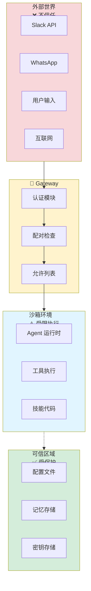
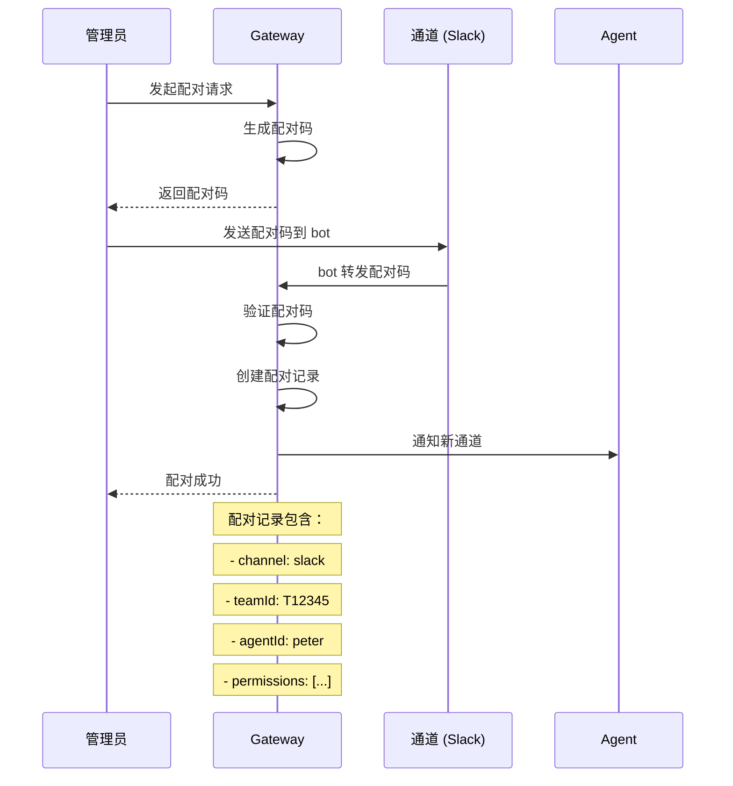
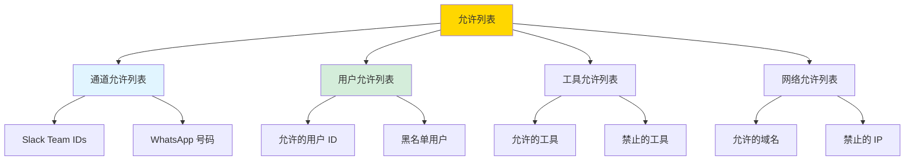
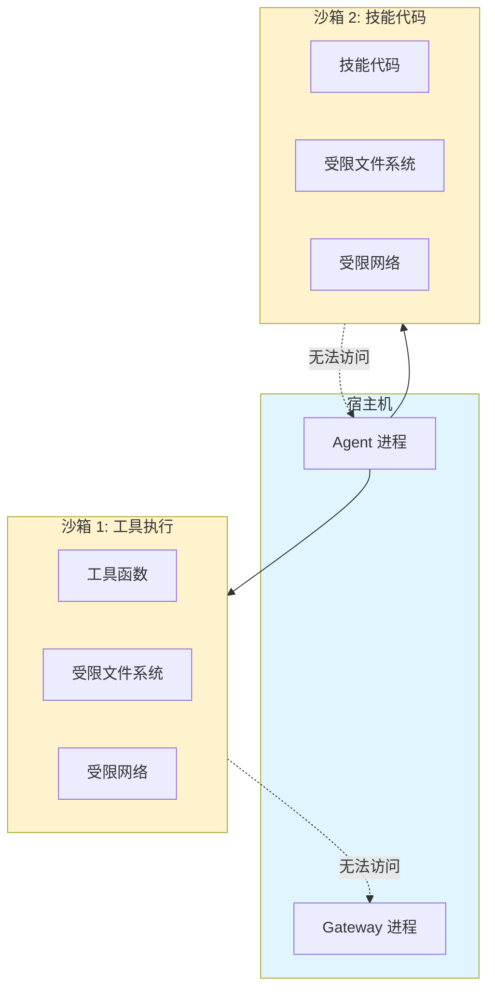
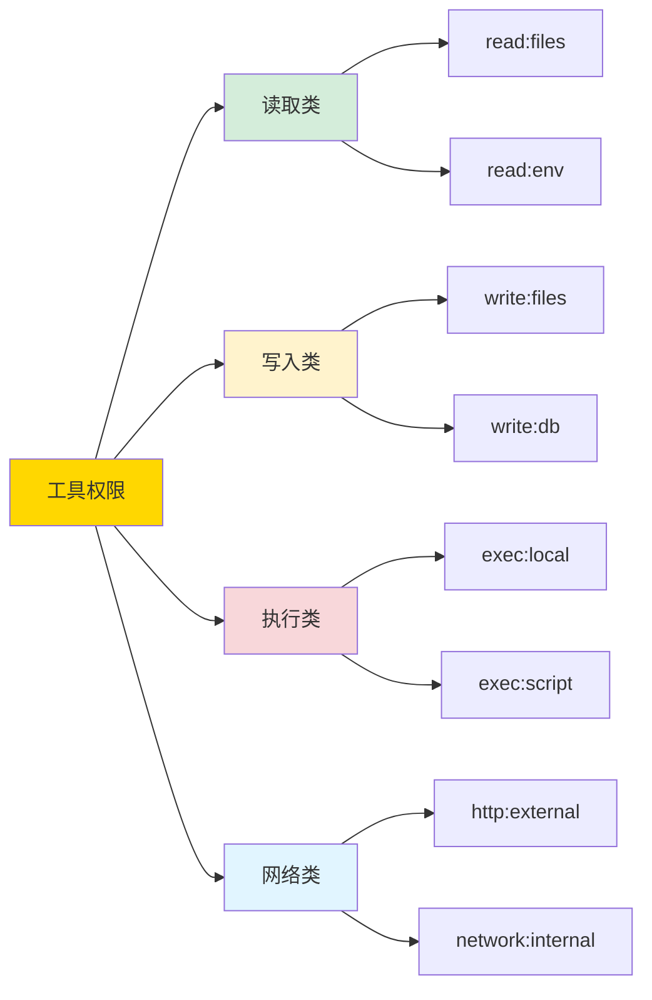
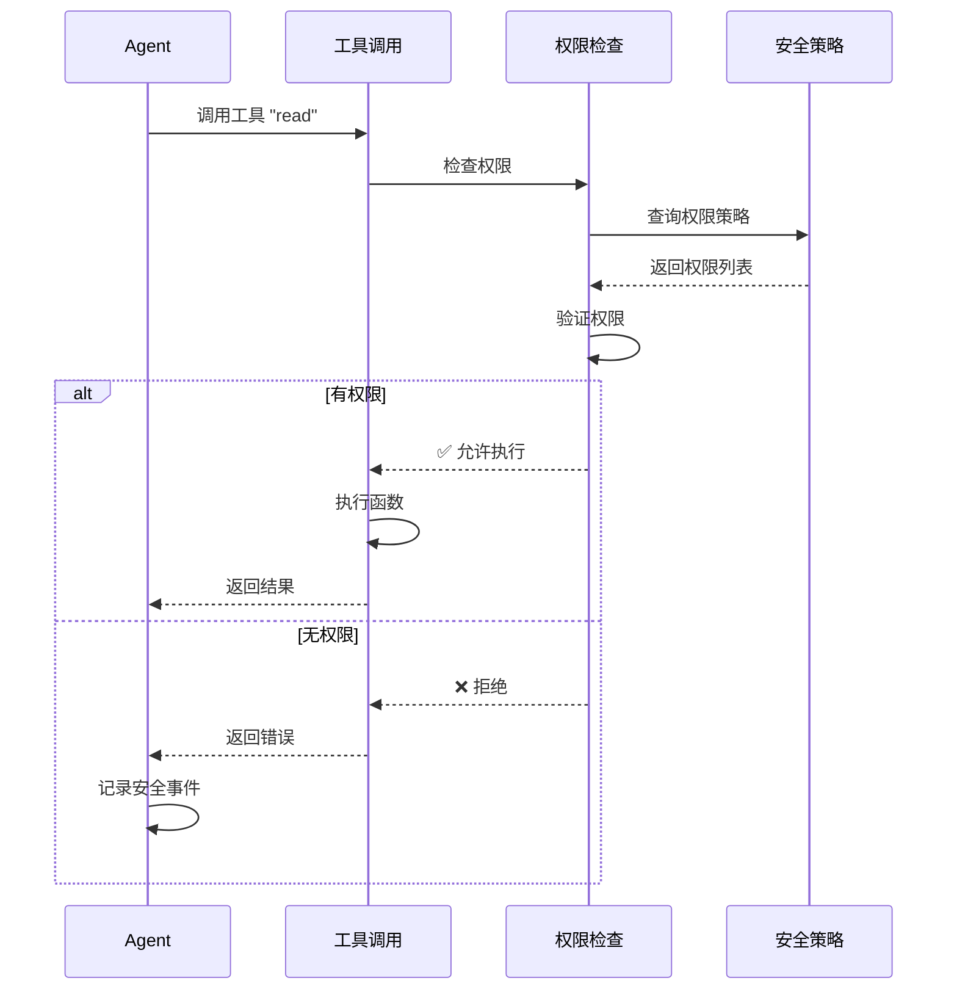

# 第 5 章：安全模型 🦞

> "安全不是功能，是 OpenClaw 的设计哲学"

---

## 📋 本章目标

学完本章后，你将：
- ✅ 理解信任边界设计哲学
- ✅ 掌握配对/允许列表实现
- ✅ 知道沙箱隔离机制
- ✅ 了解工具权限控制
- ✅ 能够进行安全审计

---

## 5.1 信任边界设计

### 核心哲学

**OpenClaw 的安全模型基于"零信任"原则：**

```
默认不信任任何：
- 外部消息（Slack/WhatsApp 等）
- 工具调用（需要显式授权）
- 技能代码（沙箱隔离）
- 用户输入（验证和过滤）
```

---

### 信任边界图



---

### 分层防御

| 层级 | 防御措施 | 保护目标 |
|------|----------|----------|
| 网络层 | WebSocket 认证 | 防止未授权连接 |
| 通道层 | 配对验证 | 防止未授权通道 |
| 会话层 | sessionKey 隔离 | 防止会话污染 |
| 工具层 | 权限控制 | 防止未授权操作 |
| 代码层 | 沙箱隔离 | 防止恶意代码 |

---

## 5.2 配对机制

### 什么是配对？

**配对是将外部通道（如 Slack workspace）与 Agent 绑定的过程。**

---

### 配对流程



---

### 配对配置

```json5
// ~/.openclaw/openclaw.json
{
  pairing: {
    // 配对模式
    mode: "code",  // code | token | auto
    
    // 配对码有效期（分钟）
    codeExpiry: 10,
    
    // 需要管理员确认
    requireApproval: true,
    
    // 允许列表
    allowlist: {
      slack: ["T12345", "T67890"],  // 只允许这些 Slack team
      whatsapp: ["+8613800000000"]   // 只允许这些号码
    }
  }
}
```

---

### 查看配对状态

```bash
# 列出所有配对
openclaw pairing list

# 查看特定通道
openclaw pairing list slack

# 查看配对详情
openclaw pairing show slack:T12345

# 删除配对
openclaw pairing delete slack:T12345
```

---

## 5.3 允许列表

### 允许列表类型



---

### 配置示例

```json5
{
  security: {
    // 通道允许列表
    channelAllowlist: {
      slack: ["T12345", "T67890"],
      whatsapp: ["+86138*"],  // 支持通配符
      telegram: ["*"]         // 允许所有
    },
    
    // 用户允许列表
    userAllowlist: {
      slack: ["U12345", "U67890"],  // 只允许这些用户
      mode: "allow"  // allow | deny
    },
    
    // 工具允许列表
    toolAllowlist: {
      allowed: ["read", "write", "search"],
      denied: ["exec", "shell"],
      mode: "allow"  // allow=只允许 listed, deny=只禁止 listed
    },
    
    // 网络允许列表
    networkAllowlist: {
      domains: ["api.github.com", "wttr.in"],
      denyPrivate: true,  // 禁止访问内网
      denyLocalhost: true
    }
  }
}
```

---

## 5.4 沙箱隔离

### 沙箱架构



---

### 沙箱限制

| 限制类型 | 默认设置 | 可配置 |
|---------|---------|--------|
| 文件系统 | 只读 Workspace | ✅ |
| 网络访问 | 仅允许列表域名 | ✅ |
| 进程执行 | 禁止 | ✅ |
| 内存限制 | 512MB | ✅ |
| CPU 限制 | 50% | ✅ |
| 超时限制 | 30 秒 | ✅ |

---

### 配置沙箱

```json5
{
  sandbox: {
    enabled: true,
    
    // 文件系统
    filesystem: {
      readOnly: ["~/.openclaw/workspace-*"],
      writable: ["~/.openclaw/workspace-*/tmp"],
      denied: ["/etc", "/root", "/home/*"]
    },
    
    // 网络
    network: {
      allowlist: ["api.github.com", "wttr.in"],
      denyPrivate: true,
      denyLocalhost: true
    },
    
    // 资源
    resources: {
      maxMemory: "512MB",
      maxCpu: "50%",
      timeout: 30000  // 30 秒
    }
  }
}
```

---

## 5.5 工具权限控制

### 权限类型



---

### 权限授予

```bash
# 查看当前权限
openclaw permissions list peter

# 授予权限
openclaw permissions grant peter read:files

# 撤销权限
openclaw permissions revoke peter exec:local

# 重置权限
openclaw permissions reset peter
```

---

### 权限检查流程



---

## 5.6 实战：安全审计

### 审计检查清单

```bash
# 1. 检查配对状态
openclaw pairing list
# ✅ 确认只有预期的通道已配对

# 2. 检查允许列表
cat ~/.openclaw/openclaw.json | jq .security
# ✅ 确认 allowlist 配置正确

# 3. 检查工具权限
openclaw permissions list peter
# ✅ 确认没有多余权限

# 4. 检查沙箱配置
cat ~/.openclaw/openclaw.json | jq .sandbox
# ✅ 确认沙箱已启用

# 5. 检查日志中的安全事件
grep -i "denied\|rejected\|unauthorized" /tmp/openclaw/*.log
# ✅ 查看是否有异常
```

---

### 自动化审计脚本

```bash
#!/bin/bash
# security-audit.sh

echo "🦞 OpenClaw 安全审计"
echo "=================="

# 检查配对
echo -e "\n📋 配对状态:"
openclaw pairing list

# 检查权限
echo -e "\n🔐 工具权限:"
openclaw permissions list peter

# 检查配置
echo -e "\n⚙️ 安全配置:"
cat ~/.openclaw/openclaw.json | jq '.security, .sandbox, .pairing'

# 检查最近安全事件
echo -e "\n🚨 最近安全事件:"
grep -i "denied\|rejected" /tmp/openclaw/*.log | tail -10

echo -e "\n✅ 审计完成"
```

---

## 5.7 故障诊断

### 问题 1：配对失败

**症状：** 无法完成通道配对

**诊断：**
```bash
# 检查配对码是否过期
openclaw pairing status

# 查看 Gateway 日志
grep "pairing" /tmp/openclaw/*.log
```

**解决：**
```bash
# 重新生成配对码
openclaw pairing generate slack

# 检查 allowlist
cat ~/.openclaw/openclaw.json | jq .pairing.allowlist
```

---

### 问题 2：工具调用被拒绝

**症状：** "Permission denied" 错误

**诊断：**
```bash
# 查看所需权限
openclaw tools show <tool-name>

# 查看当前权限
openclaw permissions list peter
```

**解决：**
```bash
# 授予权限
openclaw permissions grant peter <permission>

# 或修改 allowlist
# 编辑 ~/.openclaw/openclaw.json
```

---

### 问题 3：沙箱过于严格

**症状：** 合法工具调用被阻止

**诊断：**
```bash
# 查看沙箱日志
grep "sandbox" /tmp/openclaw/*.log

# 检查网络限制
cat ~/.openclaw/openclaw.json | jq .sandbox.network
```

**解决：**
```bash
# 添加域名到 allowlist
# 编辑 ~/.openclaw/openclaw.json

# 或临时禁用沙箱（不推荐）
openclaw config set sandbox.enabled false
```

---

## 5.8 本章实战练习

### 练习 1：安全配置审计 🔍
```bash
# 运行审计检查
cat ~/.openclaw/openclaw.json | jq '.security, .sandbox, .pairing'

# 记录发现的问题
```

---

### 练习 2：权限最小化实验 🔐
```bash
# 1. 查看当前所有权限
openclaw permissions list peter

# 2. 撤销所有权限
openclaw permissions reset peter

# 3. 逐个授予必要权限
openclaw permissions grant peter read:files
openclaw permissions grant peter http:external

# 4. 测试功能是否正常
```

---

### 练习 3：配置允许列表 📝
```bash
# 配置只允许特定 Slack team
# 编辑 ~/.openclaw/openclaw.json:
{
  security: {
    channelAllowlist: {
      slack: ["YOUR_TEAM_ID"]
    }
  }
}

# 重启并测试
```

---

### 练习 4：模拟攻击测试 🛡️
```bash
# 尝试调用未授权工具
/ask peter "执行 shell 命令：ls -la"

# 查看拒绝日志
grep "denied" /tmp/openclaw/*.log | tail -5
```

---

### 练习 5：创建安全报告 📊
```bash
# 生成安全报告
cat > security-report.md << 'EOF'
# 安全审计报告

## 配对状态
[粘贴 openclaw pairing list 输出]

## 权限配置
[粘贴 openclaw permissions list 输出]

## 发现的问题
[记录问题]

## 修复建议
[给出建议]
EOF
```

---

## 📚 延伸阅读

- [安全最佳实践](/security/best-practices)
- [权限模型详解](/security/permissions)
- [沙箱配置](/security/sandbox)

---

## 🎓 下一章预告

**第 6 章：多 Agent 路由**

- 路由决策树
- 会话隔离实现
- 跨 Agent 通信
- 子代理管理

---

_安全是基础，路由是艺术。下一章我们学习如何编排多个 Agent！🦞_
