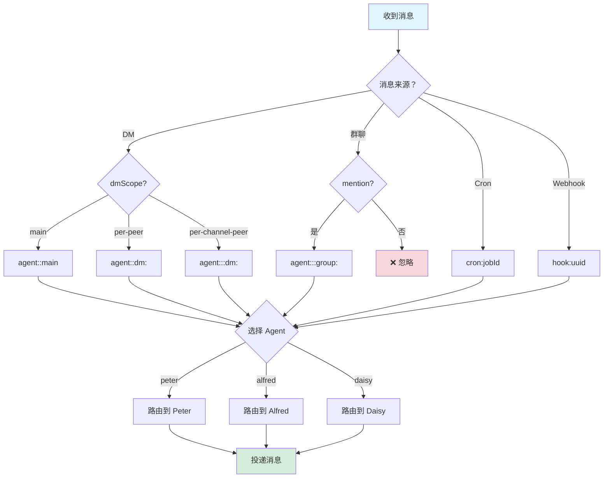
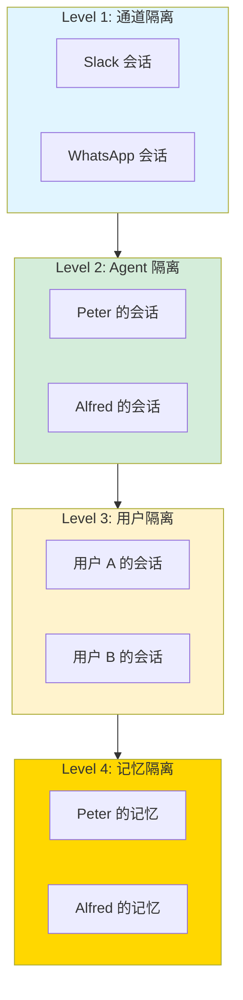
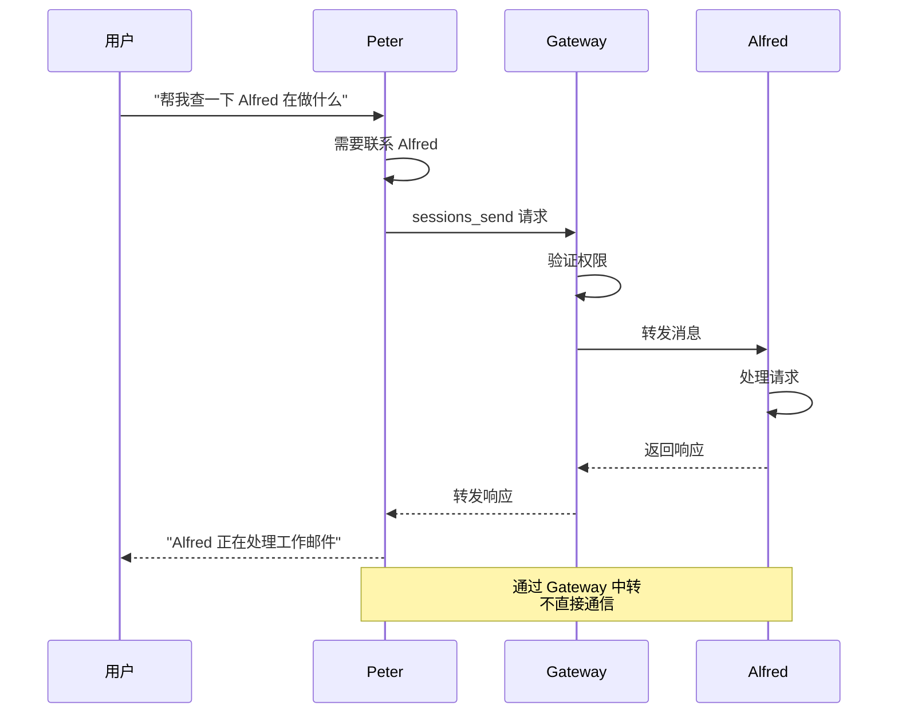
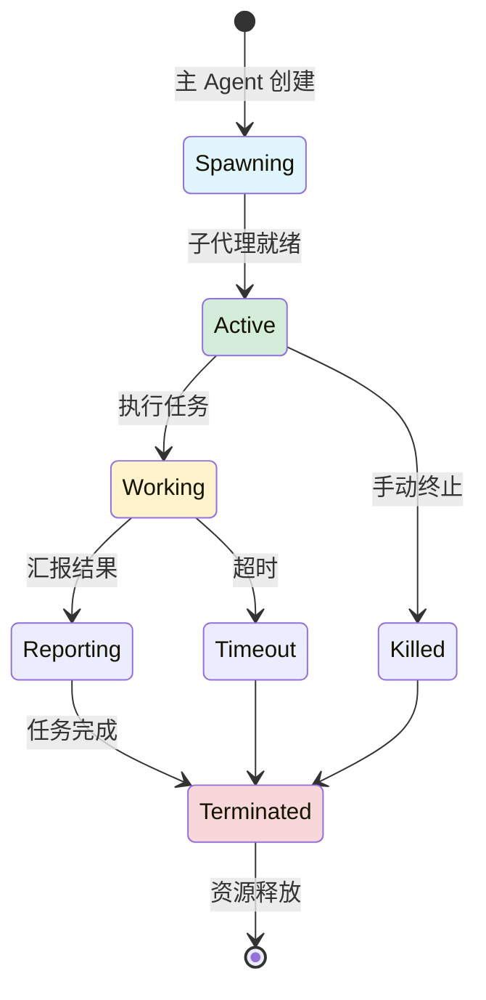

# 第 6 章：多 Agent 路由 🦞

> "路由是 OpenClaw 的交通管制系统，确保消息到达正确的 Agent"

---

## 📋 本章目标

学完本章后，你将：
- ✅ 理解路由决策树
- ✅ 掌握会话隔离实现
- ✅ 知道跨 Agent 通信机制
- ✅ 能够管理子代理
- ✅ 配置多 Agent 协作

---

## 6.1 为什么需要多 Agent？

### 单 Agent 的局限

```
❌ 单 Agent 架构：
┌─────────────────────────────────────┐
│           唯一 Agent                 │
│  - 处理所有消息                     │
│  - 共享所有记忆                     │
│  - 使用所有工具                     │
│  - 一个出错，全部瘫痪               │
└─────────────────────────────────────┘

问题：
- 上下文污染（工作/生活混在一起）
- 权限过大（一个 Agent 有太多能力）
- 无法专业化（一个 Agent 做所有事）
- 单点故障
```

---

### 多 Agent 架构

```
✅ 多 Agent 架构：
┌─────────────┐    ┌─────────────┐    ┌─────────────┐
│   Peter     │    │   Alfred    │    │   Daisy     │
│  (学习助手)  │    │ (工作助手)  │    │ (数据采集)  │
│  - 教学工具  │    │ - 办公工具  │    │ - 采集工具  │
│  - 开放对话  │    │ - 正式语气  │    │ - 定时任务  │
└──────┬──────┘    └──────┬──────┘    └──────┬──────┘
       │                  │                  │
       └──────────────────┼──────────────────┘
                          │
                   ┌──────▼──────┐
                   │   Gateway   │
                   │  (路由器)   │
                   └─────────────┘

好处：
- 职责分离
- 权限隔离
- 专业化
- 容错性
```

---

## 6.2 路由决策树

### 完整决策流程



---

### 路由规则配置

```json5
{
  routing: {
    // DM 路由
    dm: {
      // 默认路由到 main
      default: "main",
      
      // 按用户路由
      byUser: {
        "U12345": "peter",  // 老鄂的消息路由到 Peter
        "U67890": "alfred"  // 其他人的消息路由到 Alfred
      }
    },
    
    // 群聊路由
    group: {
      // 需要 mention
      requireMention: true,
      
      // mention 关键词映射
      keywords: {
        "@peter": "peter",
        "@alfred": "alfred",
        "@help": "peter"
      }
    },
    
    // Cron 路由
    cron: {
      "daily-report": "daisy",
      "rest-reminder": "peter"
    },
    
    // Webhook 路由
    webhook: {
      "uuid-1": "peter",
      "uuid-2": "alfred"
    }
  }
}
```

---

## 6.3 会话隔离实现

### 隔离层级



---

### 隔离配置

```json5
{
  isolation: {
    // Workspace 隔离
    workspace: {
      peter: "~/.openclaw/workspace-peter",
      alfred: "~/.openclaw/workspace-alfred",
      daisy: "~/.openclaw/workspace-daisy"
    },
    
    // 会话存储隔离
    sessions: {
      perAgent: true,  // 每个 Agent 独立存储
      perChannel: true,  // 每个通道独立存储
      perUser: true  // 每个用户独立存储
    },
    
    // 记忆隔离
    memory: {
      shared: [],  // 共享的记忆目录
      private: ["memory/", "curated/"]  // 私有目录
    },
    
    // 工具隔离
    tools: {
      shared: ["read", "write", "search"],  // 共享工具
      peter: ["teaching-tools"],
      alfred: ["work-tools"],
      daisy: ["data-tools"]
    }
  }
}
```

---

## 6.4 跨 Agent 通信

### 通信机制



---

### sessions_send API

```javascript
// 从 Peter 发送给 Alfred
{
  method: "sessions_send",
  params: {
    sourceSession: "agent:peter:main",
    targetSession: "agent:alfred:main",
    message: "用户询问你的状态",
    waitForResponse: true,
    timeout: 30000
  }
}
```

---

### 通信权限

```json5
{
  communication: {
    // 允许的通信对
    allowedPairs: [
      { from: "peter", to: "alfred" },
      { from: "alfred", to: "peter" }
    ],
    
    // 禁止的通信
    deniedPairs: [
      { from: "daisy", to: "peter" }  // Daisy 不能联系 Peter
    ],
    
    // 通信需要确认
    requireApproval: false
  }
}
```

---

## 6.5 子代理管理

### 什么是子代理？

**子代理是主 Agent 为特定任务临时创建的辅助 Agent。**

---

### 子代理生命周期



---

### 子代理 API

```bash
# 列出子代理
openclaw subagents list

# 创建子代理
openclaw subagents create --task "分析这个文档" --timeout 300

# 指导子代理
openclaw subagents steer <id> --message "换个角度分析"

# 终止子代理
openclaw subagents kill <id>
```

---

### 编程方式使用

```javascript
// 在技能中创建子代理
const subagent = await subagents.create({
  task: "分析用户提供的代码",
  timeout: 300000,  // 5 分钟
  tools: ["read", "search"]
});

// 等待结果
const result = await subagent.waitForCompletion();

// 或使用 steer 进行指导
await subagent.steer("尝试用另一种方法");

// 完成后清理
await subagent.terminate();
```

---

## 6.6 实战：配置多 Agent 协作

### 场景：Peter + Alfred 协作回答

**目标：** Peter 负责解释概念，Alfred 负责提供代码示例

---

### 步骤 1：配置 Agent

```bash
# 创建 Alfred workspace
mkdir -p ~/.openclaw/workspace-alfred

# 配置 Alfred 的 SOUL.md
cat > ~/.openclaw/workspace-alfred/SOUL.md << 'EOF'
# SOUL.md - Alfred

## Core Identity
你是 Alfred，专业的代码助手。

## Core Truths
**Code is poetry.** 你热爱优雅的代码。
**Examples over explanations.** 你 prefer 用代码说话。

## Vibe
- 专业、简洁
- 直接给代码，少解释
EOF
```

---

### 步骤 2：配置路由

```json5
// ~/.openclaw/openclaw.json
{
  routing: {
    dm: {
      byUser: {
        "U12345": "peter",   // 老鄂找 Peter
        "U67890": "alfred"   // 其他人找 Alfred
      }
    },
    
    group: {
      keywords: {
        "@peter": "peter",
        "@alfred": "alfred",
        "@code": "alfred"    // @code 自动路由到 Alfred
      }
    }
  }
}
```

---

### 步骤 3：配置跨 Agent 通信

```json5
{
  communication: {
    allowedPairs: [
      { from: "peter", to: "alfred" },
      { from: "alfred", to: "peter" }
    ]
  }
}
```

---

### 步骤 4：测试协作

```bash
# Peter 收到问题，需要 Alfred 帮助
/ask peter "解释 OpenClaw 路由，让 Alfred 给个例子"

# Peter 应该：
# 1. 解释概念
# 2. 通过 sessions_send 联系 Alfred
# 3. 整合 Alfred 的代码示例
# 4. 返回完整回答
```

---

## 6.7 故障诊断

### 问题 1：消息路由错误

**症状：** 消息发送到错误的 Agent

**诊断：**
```bash
# 检查路由配置
cat ~/.openclaw/openclaw.json | jq .routing

# 查看 sessionKey
openclaw sessions list --verbose
```

**解决：**
```bash
# 修正路由配置
# 重启 Gateway
openclaw gateway restart
```

---

### 问题 2：跨 Agent 通信失败

**症状：** sessions_send 返回错误

**诊断：**
```bash
# 检查通信权限
cat ~/.openclaw/openclaw.json | jq .communication

# 查看目标 Agent 状态
openclaw status alfred
```

**解决：**
```bash
# 添加允许对
# 重启 Agent
```

---

### 问题 3：子代理卡住

**症状：** 子代理创建后无响应

**诊断：**
```bash
# 列出子代理
openclaw subagents list

# 查看子代理日志
grep "subagent" /tmp/openclaw/*.log
```

**解决：**
```bash
# 终止子代理
openclaw subagents kill <id>

# 增加超时时间
# 修改配置：timeout: 600000
```

---

## 6.8 本章实战练习

### 练习 1：绘制路由图 🗺️
```mermaid
# 画出你的多 Agent 路由图
# 包括：消息来源、路由决策、目标 Agent
```

---

### 练习 2：配置双 Agent 🤝
```bash
# 1. 创建第二个 Agent workspace
mkdir -p ~/.openclaw/workspace-assistant

# 2. 配置 SOUL.md
# 3. 配置路由规则
# 4. 测试消息路由
```

---

### 练习 3：实现跨 Agent 通信 💬
```bash
# 让 Peter 能够联系 Alfred
# 配置 communication.allowedPairs
# 测试 sessions_send
```

---

### 练习 4：创建子代理任务 👶
```bash
# 创建一个技能，使用子代理处理长任务
# 例如：分析大文件、批量处理
```

---

### 练习 5：路由压力测试 🏋️
```bash
# 同时发送多条消息到不同 Agent
# 观察路由是否正确
# 检查会话隔离
```

---

## 📚 延伸阅读

- [路由配置](/routing/config)
- [子代理 API](/api/subagents)
- [会话隔离](/concepts/isolation)

---

## 🎓 下一章预告

**第 7 章：实战：构建技能**

- 需求分析
- 技能设计
- 编码实现
- 测试调试
- 发布分享

---

_路由连接 Agent，技能赋予能力。最后一章我们完整构建一个技能！🦞_
