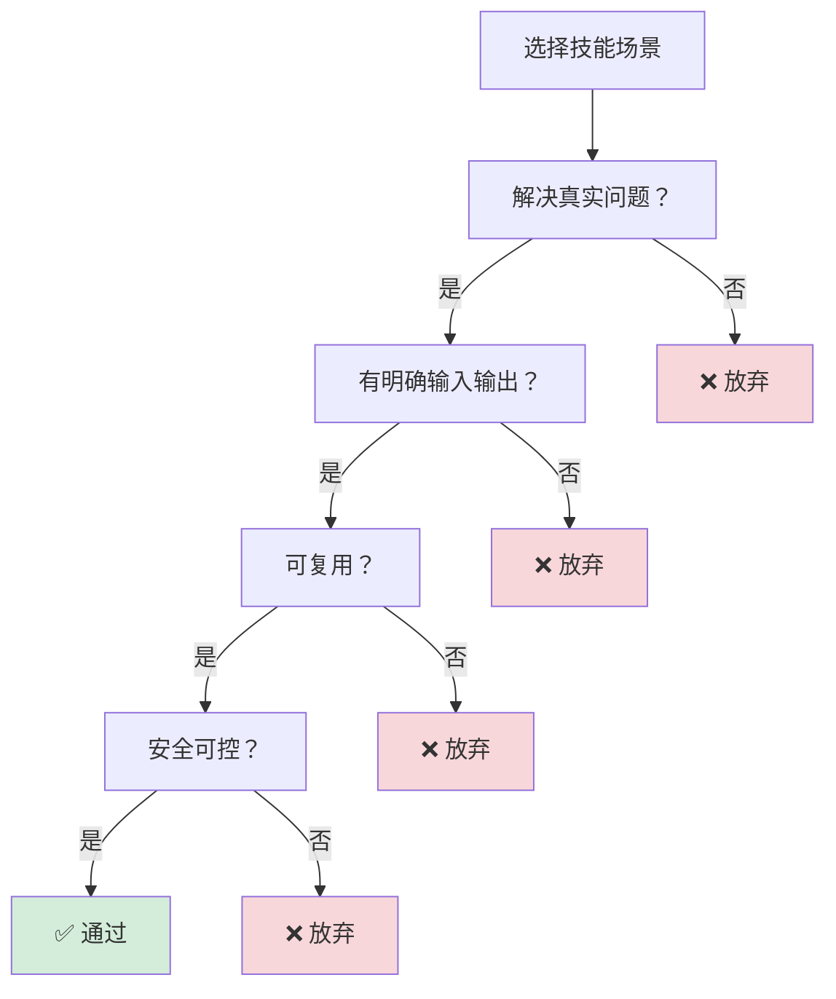
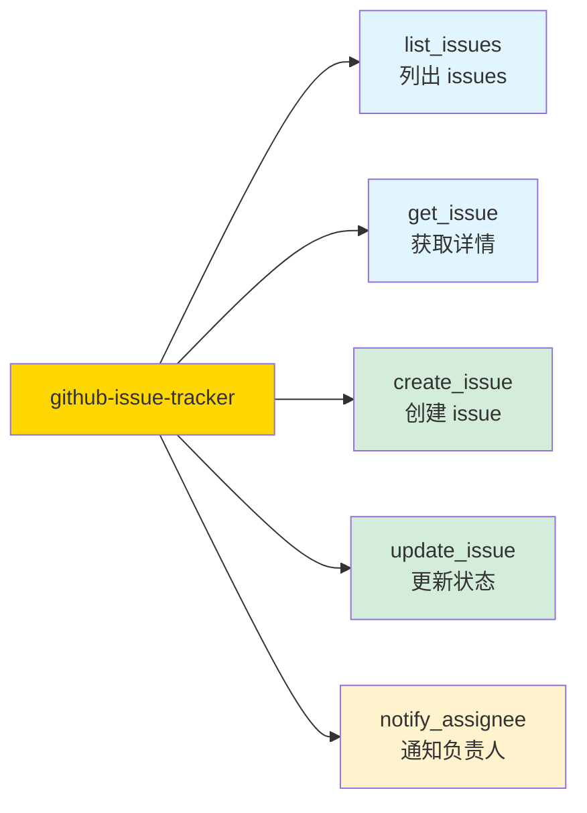
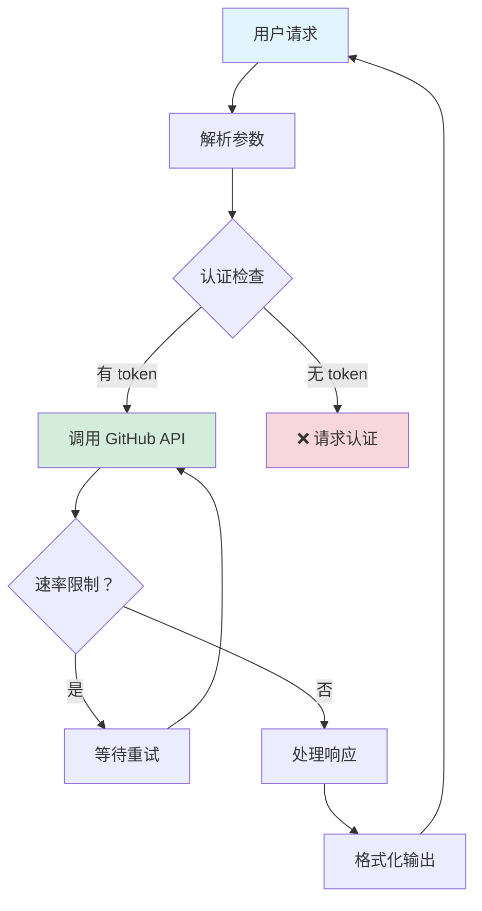
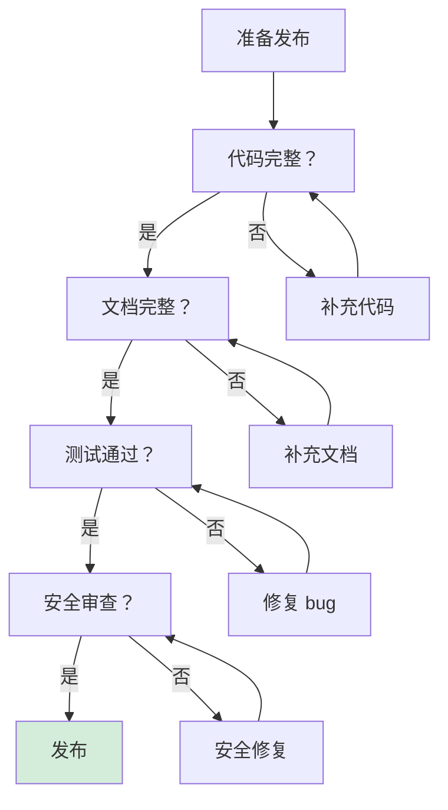

# 第 7 章：实战：构建技能 🦞

> "从 0 到 1，创建一个真正的 OpenClaw 技能"

---

## 📋 本章目标

学完本章后，你将：
- ✅ 能够进行技能需求分析
- ✅ 掌握技能设计方法
- ✅ 完成完整编码实现
- ✅ 知道测试调试技巧
- ✅ 了解发布分享流程

---

## 7.1 需求分析：选择一个实用场景

### 场景选择原则



---

### 好场景 vs 坏场景

| 好场景 ✅ | 坏场景 ❌ |
|----------|----------|
| 天气查询（明确 API） | "帮我赚钱"（太模糊） |
| TODO 管理（CRUD 操作） | "变得更有创意"（无法量化） |
| 文件转换（输入→输出） | "理解用户情绪"（太主观） |
| 定时提醒（时间→通知） | "预测未来"（不可能） |

---

### 本章实战项目：GitHub Issue 追踪技能

**需求：**
- 查询仓库的 open issues
- 创建新 issue
- 更新 issue 状态
- 通知 assignee

**为什么是好场景：**
- ✅ 有明确的 GitHub API
- ✅ 输入输出清晰
- ✅ 可复用（任何 GitHub 用户）
- ✅ 安全（只读 + 授权写入）

---

## 7.2 技能设计：定义工具和流程

### 工具列表



---

### 工具定义

```javascript
// tools/list_issues.js
module.exports = {
  name: 'list_issues',
  description: '列出仓库的 open issues',
  
  params: {
    owner: {
      type: 'string',
      required: true,
      description: '仓库所有者'
    },
    repo: {
      type: 'string',
      required: true,
      description: '仓库名称'
    },
    state: {
      type: 'string',
      default: 'open',
      enum: ['open', 'closed', 'all']
    }
  }
};

// tools/create_issue.js
module.exports = {
  name: 'create_issue',
  description: '创建新 issue',
  
  params: {
    owner: { type: 'string', required: true },
    repo: { type: 'string', required: true },
    title: { type: 'string', required: true },
    body: { type: 'string', required: false },
    labels: { type: 'array', required: false },
    assignees: { type: 'array', required: false }
  }
};
```

---

### 数据流设计



---

## 7.3 编码实现：完整示例

### 步骤 1：创建目录结构

```bash
# 创建技能目录
mkdir -p ~/.openclaw/skills/github-issue-tracker/{tools,scripts,references}

# 创建 SKILL.md
cat > ~/.openclaw/skills/github-issue-tracker/SKILL.md << 'EOF'
# github-issue-tracker

> GitHub Issue 追踪和管理技能

## Description

帮助开发者管理 GitHub 仓库的 issues，包括查询、创建、更新和通知。

## Tools

- `list_issues` - 列出仓库的 issues
- `get_issue` - 获取 issue 详情
- `create_issue` - 创建新 issue
- `update_issue` - 更新 issue 状态
- `notify_assignee` - 通知 issue 负责人

## Configuration

```json5
{
  github_issue_tracker: {
    token: "ghp_xxx",  // GitHub Personal Access Token
    defaultOwner: "daurathz",
    defaultRepo: "openclaw"
  }
}
```

## Permissions

- http:external (GitHub API)
- read:env (读取配置)

## Usage

```
/ask agent "列出 daurathz/openclaw 的 open issues"
/ask agent "创建一个新 issue：修复登录 bug"
```
EOF
```

---

### 步骤 2：实现 list_issues 工具

```javascript
// tools/list_issues.js
const https = require('https');

module.exports = {
  name: 'list_issues',
  description: '列出 GitHub 仓库的 issues',
  
  params: {
    owner: {
      type: 'string',
      required: true,
      description: '仓库所有者（如 daurathz）'
    },
    repo: {
      type: 'string',
      required: true,
      description: '仓库名称（如 openclaw）'
    },
    state: {
      type: 'string',
      default: 'open',
      enum: ['open', 'closed', 'all'],
      description: 'issue 状态'
    },
    limit: {
      type: 'number',
      default: 10,
      description: '返回数量限制'
    }
  },
  
  async execute(params, context) {
    const { owner, repo, state, limit } = params;
    const token = context.config.github_issue_tracker?.token;
    
    if (!token) {
      return {
        success: false,
        error: 'GitHub token 未配置'
      };
    }
    
    return new Promise((resolve, reject) => {
      const options = {
        hostname: 'api.github.com',
        path: `/repos/${owner}/${repo}/issues?state=${state}&per_page=${limit}`,
        method: 'GET',
        headers: {
          'User-Agent': 'OpenClaw-Skill',
          'Authorization': `token ${token}`,
          'Accept': 'application/vnd.github.v3+json'
        }
      };
      
      const req = https.request(options, (res) => {
        let data = '';
        res.on('data', chunk => data += chunk);
        res.on('end', () => {
          if (res.statusCode === 200) {
            const issues = JSON.parse(data);
            resolve({
              success: true,
              data: issues.map(issue => ({
                number: issue.number,
                title: issue.title,
                state: issue.state,
                labels: issue.labels.map(l => l.name),
                assignees: issue.assignees.map(a => a.login),
                createdAt: issue.created_at,
                url: issue.html_url
              }))
            });
          } else {
            resolve({
              success: false,
              error: `GitHub API 错误：${res.statusCode}`,
              data: data
            });
          }
        });
      });
      
      req.on('error', reject);
      req.end();
    });
  }
};
```

---

### 步骤 3：实现 create_issue 工具

```javascript
// tools/create_issue.js
const https = require('https');

module.exports = {
  name: 'create_issue',
  description: '创建新的 GitHub issue',
  
  params: {
    owner: { type: 'string', required: true },
    repo: { type: 'string', required: true },
    title: { type: 'string', required: true },
    body: { type: 'string', required: false },
    labels: { type: 'array', items: { type: 'string' }, required: false },
    assignees: { type: 'array', items: { type: 'string' }, required: false }
  },
  
  async execute(params, context) {
    const { owner, repo, title, body, labels, assignees } = params;
    const token = context.config.github_issue_tracker?.token;
    
    if (!token) {
      return { success: false, error: 'GitHub token 未配置' };
    }
    
    const postData = JSON.stringify({
      title,
      body: body || '',
      labels: labels || [],
      assignees: assignees || []
    });
    
    return new Promise((resolve, reject) => {
      const options = {
        hostname: 'api.github.com',
        path: `/repos/${owner}/${repo}/issues`,
        method: 'POST',
        headers: {
          'User-Agent': 'OpenClaw-Skill',
          'Authorization': `token ${token}`,
          'Accept': 'application/vnd.github.v3+json',
          'Content-Type': 'application/json',
          'Content-Length': Buffer.byteLength(postData)
        }
      };
      
      const req = https.request(options, (res) => {
        let data = '';
        res.on('data', chunk => data += chunk);
        res.on('end', () => {
          if (res.statusCode === 201) {
            const issue = JSON.parse(data);
            resolve({
              success: true,
              data: {
                number: issue.number,
                title: issue.title,
                url: issue.html_url,
                message: `Issue #${issue.number} 创建成功`
              }
            });
          } else {
            resolve({
              success: false,
              error: `GitHub API 错误：${res.statusCode}`,
              data: data
            });
          }
        });
      });
      
      req.on('error', reject);
      req.write(postData);
      req.end();
    });
  }
};
```

---

### 步骤 4：实现 notify_assignee 工具

```javascript
// tools/notify_assignee.js
module.exports = {
  name: 'notify_assignee',
  description: '通知 issue 的负责人（通过 Slack 或其他通道）',
  
  params: {
    issueUrl: { type: 'string', required: true },
    message: { type: 'string', required: true },
    channel: { type: 'string', default: 'slack' }
  },
  
  async execute(params, context) {
    const { issueUrl, message, channel } = params;
    
    // 这里可以集成 Slack、邮件等通知方式
    // 简化示例：返回通知内容
    
    return {
      success: true,
      data: {
        notified: true,
        channel: channel,
        message: `🔔 新通知：${message}\nIssue: ${issueUrl}`
      }
    };
  }
};
```

---

## 7.4 测试调试：常见问题处理

### 本地测试

```bash
# 1. 语法检查
node -c ~/.openclaw/skills/github-issue-tracker/tools/list_issues.js
node -c ~/.openclaw/skills/github-issue-tracker/tools/create_issue.js

# 2. 加载技能
openclaw skills reload

# 3. 查看工具列表
openclaw tools list | grep github
```

---

### 功能测试

```bash
# 测试 list_issues
/ask peter "列出 daurathz/openclaw 的 open issues"

# 测试 create_issue
/ask peter "在 daurathz/openclaw 创建一个 issue：测试技能功能"

# 预期输出：
# Issue #XX 创建成功
# URL: https://github.com/daurathz/openclaw/issues/XX
```

---

### 常见问题及解决

| 问题 | 原因 | 解决 |
|------|------|------|
| 工具未加载 | 语法错误 | `node -c` 检查语法 |
| API 认证失败 | Token 无效 | 重新生成 GitHub token |
| 速率限制 | 请求太频繁 | 添加重试逻辑 |
| 参数验证失败 | 参数类型错误 | 检查 params 定义 |

---

### 调试技巧

```javascript
// 在工具中添加日志
async execute(params, context) {
  console.log('[github-issue-tracker] 调用 list_issues');
  console.log('[github-issue-tracker] 参数:', params);
  console.log('[github-issue-tracker] 配置:', context.config);
  
  // ... 其余代码
}

// 查看日志
tail -f /tmp/openclaw/*.log | grep github-issue-tracker
```

---

## 7.5 发布分享：如何贡献到社区

### 发布前检查清单



---

### 发布步骤

```bash
# 1. 整理代码结构
cd ~/.openclaw/skills/github-issue-tracker

# 2. 创建 README
cat > README.md << 'EOF'
# github-issue-tracker

GitHub Issue 追踪技能。

## 安装

```bash
git clone <repo-url> ~/.openclaw/skills/github-issue-tracker
```

## 配置

在 config.json 中添加：
```json5
{
  github_issue_tracker: {
    token: "ghp_xxx"
  }
}
```

## 使用

```
/ask agent "列出 owner/repo 的 issues"
```
EOF

# 3. 初始化 Git
git init
git add .
git commit -m "Initial release: github-issue-tracker skill"

# 4. 推送到 GitHub
git remote add origin https://github.com/your-username/github-issue-tracker.git
git push -u origin main
```

---

### 分享到社区

1. **OpenClaw 官方仓库** - 提 PR 到 `openclaw/skills`
2. **社区技能列表** - 在 Discord/Slack 分享
3. **文档贡献** - 更新 docs.openclaw.ai

---

### 技能模板

```
skill-template/
├── SKILL.md          # 技能定义
├── README.md         # 使用说明
├── tools/
│   ├── tool1.js
│   └── tool2.js
├── scripts/          # 辅助脚本
├── references/       # 参考文档
├── examples/         # 使用示例
├── tests/            # 测试用例
└── package.json      # 依赖（如有）
```

---

## 7.6 本章实战练习

### 练习 1：需求分析 📝
选择一个你想解决的问题：
- 描述问题
- 定义输入输出
- 列出需要的工具
- 评估安全性

---

### 练习 2：创建简单技能 🛠️
创建一个"名言生成"技能：
- 工具：`quote` - 返回随机名言
- 数据：内置 10 条名言
- 测试功能

---

### 练习 3：实现 API 调用 🌐
创建一个"汇率查询"技能：
- 使用免费汇率 API
- 实现 `convert` 工具
- 处理错误和重试

---

### 练习 4：添加配置支持 ⚙️
为你的技能添加配置：
- 在 SKILL.md 定义配置项
- 在工具中读取配置
- 测试配置生效

---

### 练习 5：发布技能 🚀
- 创建 README
- 推送到 GitHub
- 分享到社区

---

## 📚 延伸阅读

- [技能开发指南](/skills/development)
- [工具 API 参考](/api/tools)
- [社区技能列表](https://github.com/openclaw/skills)

---

## 🎉 恭喜你！

**你已经完成了 OpenClaw Deep Dive 的全部内容！**

---

## 完整章节回顾

| 章节 | 主题 | 核心内容 |
|------|------|----------|
| 第 1 章 | Gateway 架构 | WebSocket、消息路由、会话管理 |
| 第 2 章 | Agent 运行时 | Workspace、文件注入、工具调用 |
| 第 3 章 | 会话管理 | sessionKey、隔离策略、存储结构 |
| 第 4 章 | 技能系统 | 技能结构、工具注册、加载机制 |
| 第 5 章 | 安全模型 | 信任边界、配对、权限控制 |
| 第 6 章 | 多 Agent 路由 | 路由决策、跨 Agent 通信、子代理 |
| 第 7 章 | 构建技能 | 需求分析、编码实现、发布分享 |

---

## 下一步

1. **实践** - 用学到的知识解决实际问题
2. **分享** - 创建技能，贡献社区
3. **深入** - 阅读源码，理解细节
4. **反馈** - 提 issue，帮助改进文档

---

_🦞 OpenClaw 的世界等你来探索！_
